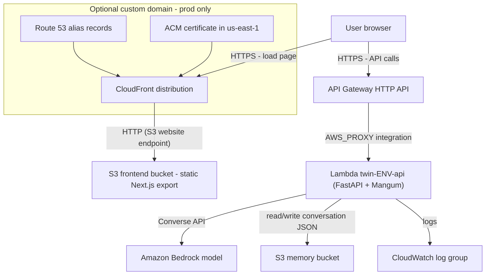

I wanted to build a chatbot that acts as my digital twin. In a nutshell, visitors open a web page, type their question, and an LLM replies with the context. It is a small system, which makes it a good excuse to talk about system design 😅.

So the acceptance criteria are:

- Being able to chat with an LLM.
- Remember the conversation between requests.
- Costs close to zero when nobody is talking to it.

Those four points already push the design toward serverless, traffic is spiky and mostly idle.

## The Architecture



The browser makes two independent trips:

1. **Page load**: browser, then CloudFront, then an S3 bucket holding a static Next.js export. There is no server rendering. The page is just files.
2. **API calls**: JS in the browser calls API Gateway, which invokes a Lambda function. The function talks to Bedrock and to a second S3 bucket, and writes logs to CloudWatch.

The important design decision is the split: the **frontend is static** and the **backend is a single function**. Neither needs a running machine.

## The Pieces & Why They Are There

- **Frontend: CloudFront + S3:** Static hosting is the cheapest and most scalable way to serve a UI. The CDN caches the bundle at the edge and gives HTTPS. A static export means the "frontend server" is not something I operate.
- **API Gateway (HTTP API)** is the front door of the backend. It gives routes (`/chat`, `/health`), CORS, throttling and TLS, so the function contains only business logic. Throttling matters more than usual here, because every request costs real money at the LLM. A low rate limit is a cheap safeguard against abuse (this is especially true in the frontend application).
- **Lambda:** One function runs a whole FastAPI app behind an adapter ([Mangum](https://pypi.org/project/magnum)) that translates API Gateway events into [ASGI](https://en.wikipedia.org/wiki/Asynchronous_Server_Gateway_Interface) requests. This is the "monolithic function" (sometimes called a "lambdalith") style: one function, many routes. A big benefit is that the same app runs locally with a normal web server, so development does not need any [cloud emulator](https://dev.to/tarekcheikh/run-real-aws-lambda-on-your-laptop-2peb).
- **Amazon Bedrock** is a managed gateway to foundation models. The function never hosts a model. It sends the system prompt, the conversation history and the new message to the Converse API and gets text back.
- **S3 as memory:** Lambda functions & models in Bedrock are stateless and may be a fresh instance on every call, so state has to live somewhere else. S3 is not a database, and it has no querying or partial updates, but for "load a small document, append, save" it is simple, durable and almost free. If the twin needed concurrent writers, querying data, a key-value store such as DynamoDB would be the natural next step.

  I did not define a TTL for the keys we have in AWS S3 but I believe you should do it if you really wanna deploy this. Maybe for 8 hours or so. But do not forget about the UI to reload itself after the TTL defined for the AWS S3 bucket for the memory.

- **CloudWatch Logs** is where you can find output of Lambda functions with a retention period, so logs do not grow forever.

## Environments

`dev`, `test` and `prod` are the same infrastructure code with different names. Every resource is prefixed with the project and environment, so several copies can live in one account. Only `prod` gets the optional custom domain ([Route 53](https://aws.amazon.com/route53/) and an [ACM certificate](https://docs.aws.amazon.com/acm/latest/userguide/acm-overview.html)).

## IaC (Infrastructure as Code) Reigns Supreme

So make sure to create a new IAM user using the root account, then we use that limited account to provision the bootstrap infra + digital-twin infra. All of it is Terraform:

- A **bootstrap** stack, applied once by hand, that creates the resources the CI/CD pipeline needs before it can exist: the remote state bucket and the trust between GitHub and AWS.
- An **app** stack, applied by the CI/CD pipeline, containing everything in the diagram above.

Push to `main` builds the function package, applies Terraform, builds and syncs the frontend, then invalidates the CDN cache. A manual workflow tears the selected environment down. That is all it needs to do.

## Other Approaches when going Serverless

## Other Approaches when going Serverless

Honestly when I did use Mangum I felt there should be other ways for doing this. So I decided to do a bit of a research and here is how the options compare and where each tends to be used (disclaimer, I have not done much serverless development). These are related serverless patterns, but keep in mind they solve different problems:

| Approach                                             | What it is                                                                                                                     | Good fit                                                                                                                                                                | Example                                                                                                                     |
| ---------------------------------------------------- | ------------------------------------------------------------------------------------------------------------------------------ | ----------------------------------------------------------------------------------------------------------------------------------------------------------------------- | --------------------------------------------------------------------------------------------------------------------------- |
| **Function per route**                               | Each API route is handled by a separate function.                                                                              | Useful when endpoints need different permissions, dependencies, or scaling. **Example:** `POST /orders` → `createOrder` Lambda; `GET /orders/{id}` → `getOrder` Lambda. | [aws-samples/lambda-java8-dynamodb](https://github.com/aws-samples/lambda-java8-dynamodb)                                   |
| **Monolithic function**                              | One function serves multiple API routes, often through a web framework.                                                        | Good for small/medium APIs where simple deployment and local development matter. **Example:** one FastAPI + Mangum Lambda handling `/chat`, `/health`, etc.             | [aws-serverless-crud-sample](https://github.com/aws-samples/aws-serverless-crud-sample)                                     |
| **Lambda container image**                           | A Lambda function is packaged as an OCI container image instead of a ZIP. Lambda supports images up to **10 GB uncompressed**. | Useful for large/native dependencies or teams already using Docker. **Example:** Python function containing ML/native libraries.                                        | [aws-samples/aws-lambda-docker-serverless-inference](https://github.com/aws-samples/aws-lambda-docker-serverless-inference) |
| **Lambda layers** _(packaging, not an architecture)_ | Shared dependencies are packaged separately from function code.                                                                | Useful when several Lambda functions share the same libraries. **Example:** three functions sharing a common Python dependency layer.                                   | [Working with layers for Python Lambda functions](https://docs.aws.amazon.com/lambda/latest/dg/python-layers.html)          |
| **Serverless containers (ECS/Fargate)**              | Run Docker containers without managing the underlying servers.                                                                 | Useful for containerized applications that need longer-running processes, custom runtimes, or container-based deployment                                                | FastAPI running as an ECS Fargate service                                                                                   |
| **Edge functions**                                   | Small functions run at CloudFront edge locations, close to users.                                                              | Useful for redirects, header changes, authorization, URL rewriting, and personalization. **Example:** redirect `/old` → `/new` at the edge.                             | [aws-samples/amazon-cloudfront-functions](https://github.com/aws-samples/amazon-cloudfront-functions)                       |
| **Event-driven functions**                           | Functions run because something happened rather than because an HTTP request arrived.                                          | Useful for async processing and automation. **Example:** S3 upload → Lambda → image thumbnail generation.                                                               | [aws-samples/event-driven-arch-eventbridge-lambda](https://github.com/aws-samples/event-driven-arch-eventbridge-lambda)     |
| **Workflow orchestration**                           | A workflow service coordinates multiple functions and steps.                                                                   | Useful for retries, branching, waiting, parallel work, or human approval. **Example:** Step Functions → validate order → charge payment → send confirmation.            | [aws-samples/lambda-refarch-imagerecognition](https://github.com/aws-samples/lambda-refarch-imagerecognition)               |

> [!IMPORTANT]
>
> - Fargate is **not** simply "long-lived containers that scale to zero". Fargate is serverless container compute, but scaling to zero is a configuration choice rather than an inherent property.
> - **Lambda does support response streaming**, so "streaming → containers" should not be stated as an absolute rule. Lambda can stream responses through supported integrations, although the practical constraints differ from a long-lived streaming service.

Some rules of thumb:

- **Synchronous HTTP APIs** with bursty traffic are the sweet spot for [FaaS](https://www.ibm.com/think/topics/faas). Choose the monolith to start and split only when there is a concrete reason (different permissions, a hot endpoint needing more memory).
- **Long-running, streaming or stateful** work tends to fit containers better. Functions have hard timeouts, and API Gateway has its own, lower, integration limit.
- **Glue between AWS managed services** (a file lands in a bucket, something has to happen) is the most common and most natural FaaS use. A concrete example is [aws-samples/lambda-refarch-fileprocessing](https://github.com/aws-samples/lambda-refarch-fileprocessing), it demonstrates this flow:
  ```text
  S3 object upload
    → S3 event notification
    → SNS
    → SQS queues
    → Lambda functions
    → S3 / DynamoDB
  ```
- **LLM-backed endpoints** are slow (seconds), so the function spends most of its time waiting on I/O. Timeouts must be sized for the model, and the gateway timeout is often the real ceiling. For token streaming you would look at response streaming or a container-based service instead.

## Making a FaaS Reproducible & Light

A function that is hard to rebuild or heavy to ship becomes painful to manage. These are the habits that matter most.

### Reproducible

- **Lock dependencies.** Keep a lockfile (uv, Poetry, pip-tools, npm lockfile) and build from the lockfile, never from loose version ranges. Two builds a month apart should contain the same packages.
- **Build in the target environment.** Compiled packages must match the runtime's OS and CPU architecture. Here I tried to install dependencies inside the official Lambda base image, so what runs in the cloud is what was built. Though when running it locally I am not dockerizing it really. **So pin the runtime and the architecture.** Language version and CPU type (x86_64 versus arm64) are part of the artifact. Write them down in code, not in someone's memory.
- **One command to package, one to deploy.** If shipping needs manual steps, it is not reproducible.
- **IaC:** So an environment can be destroyed and rebuilt at any time.
- **Configuration through environment variables:** Build once, configure per environment.
- **Keep it stateless.** State lives in S3, a database or a cache.

### Lightweight

- **Ship only runtime dependencies:** A production-only export from the lockfile is enough.
- **Prefer small libraries.** In my example the AWS SDK is already present in the Lambda Python runtime, and a lean web framework plus an adapter is far smaller than a full-stack one. Every megabyte adds to cold start time!
- **Only binary wheels, no build tools.**
- **Use layers or a container image only when they earn it.** Layers help when many functions share dependencies. Containers help when the dependency set is large or native. For a small function a plain zip is the simplest and fastest to start.
- **Do heavy initialization once.** E.g. I load the prompt file and create the SDK clients at module import time, so warm invocations reuse them.
- **Right-size memory.** In Lambda, memory also sets CPU. More memory can make a function cheaper overall, because it finishes sooner. Measure instead of guessing.
  ```hcl
  resource "aws_lambda_function" "create_order" {
    memory_size = 1024
    # ...
  }
  ```
- **A FaaS function should be glue and business logic, not infrastructure.** When the function needs a capability that AWS already sells as a managed service, call that service over the network instead of pulling that capability into your deployment artifact and running it yourself.
- **Cap the blast radius.** Set timeouts, log retention and throttling deliberately, especially when using something like a LLM which is pay-per-token.

## Trade-offs

- **Cold starts** add latency on the first request after idle time. For a chat UI that is acceptable. For a latency-critical API you would consider provisioned concurrency or a container service.
- **S3 as a store** is simple, but has no queries or sophisticated transaction. It is fine for one user per session.

## Takeaways

- A monolithic function is a good default for a small API. Split it only when a real constraint appears.
- Reproducibility comes from lockfiles, building in the target runtime, configuration through environment variables and everything defined as code. Lightness comes from shipping only what runs.
