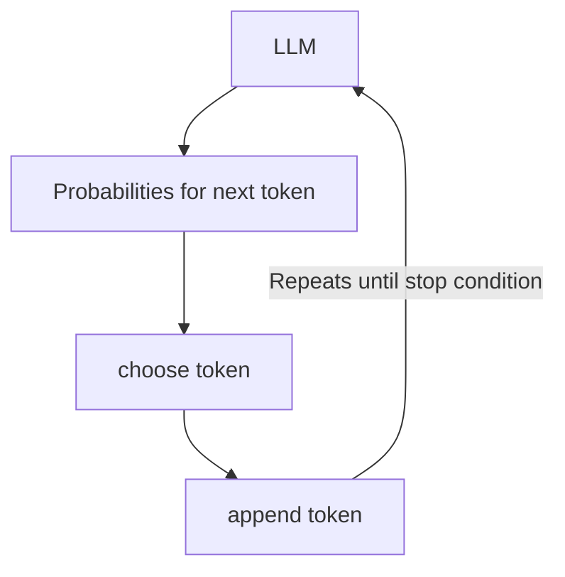
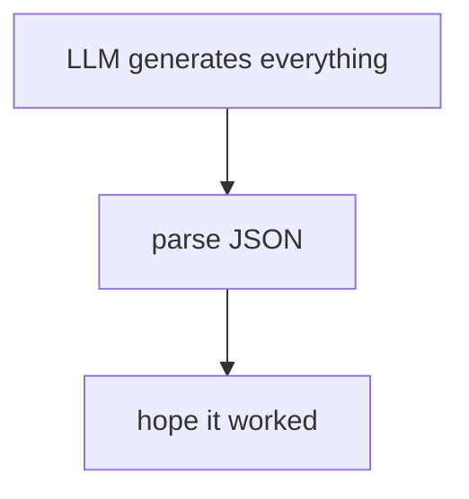
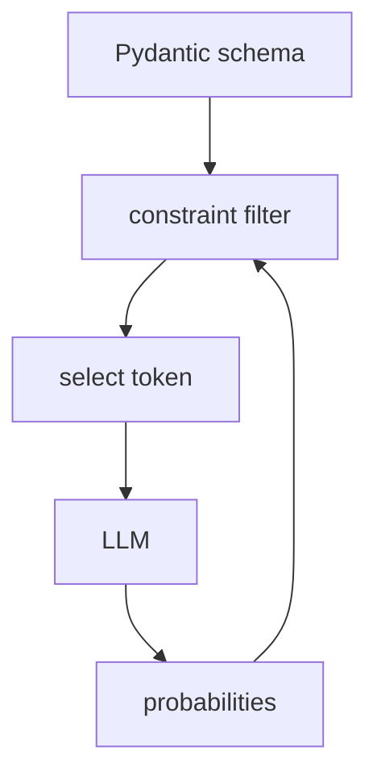
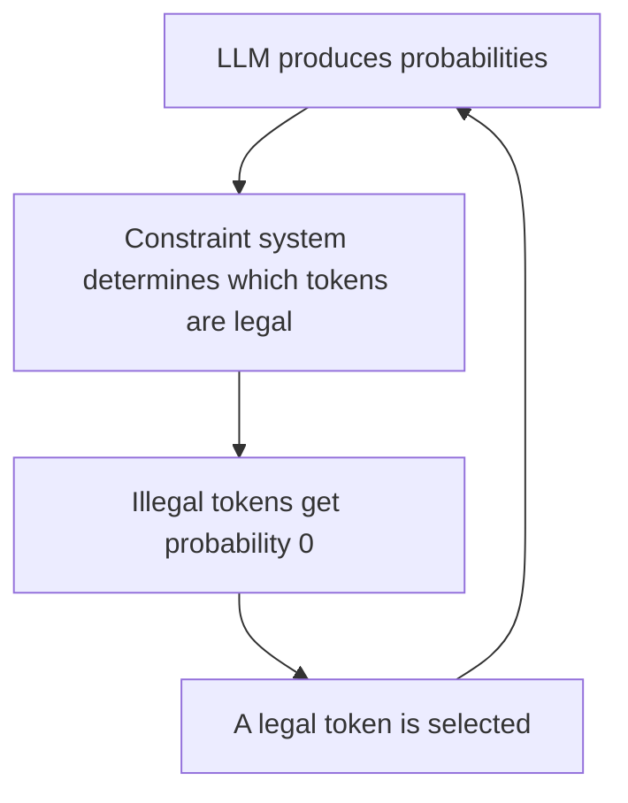
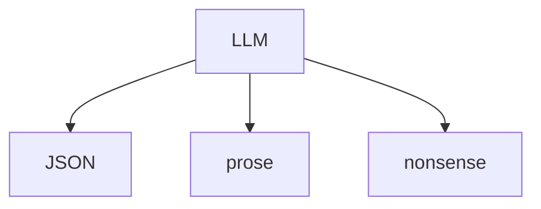
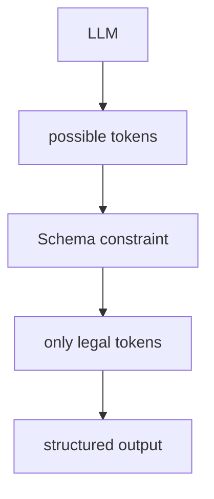
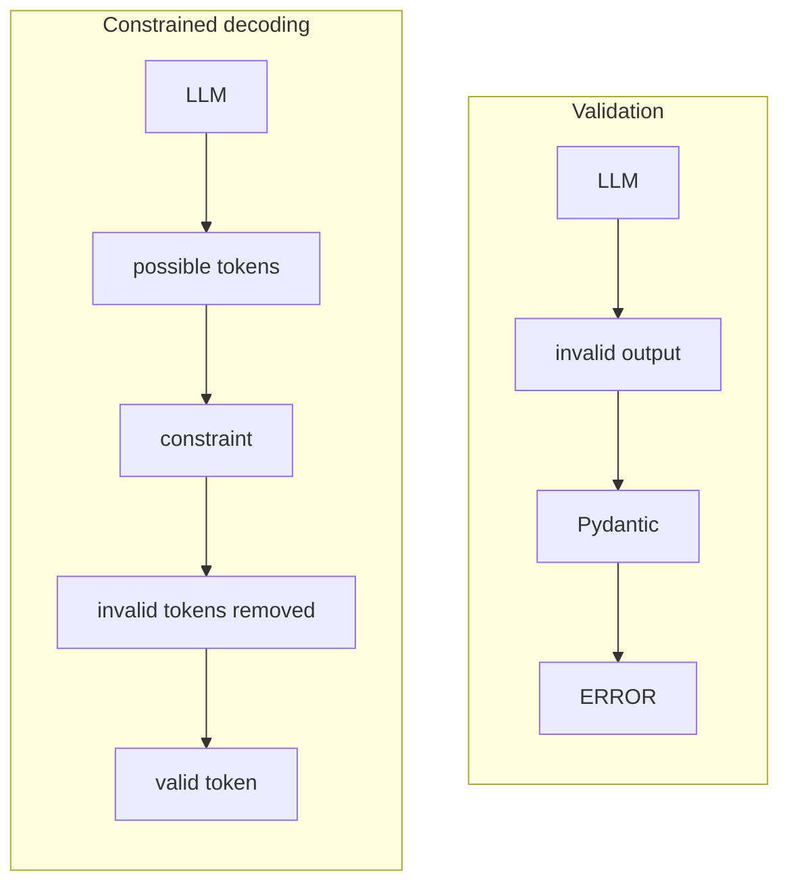
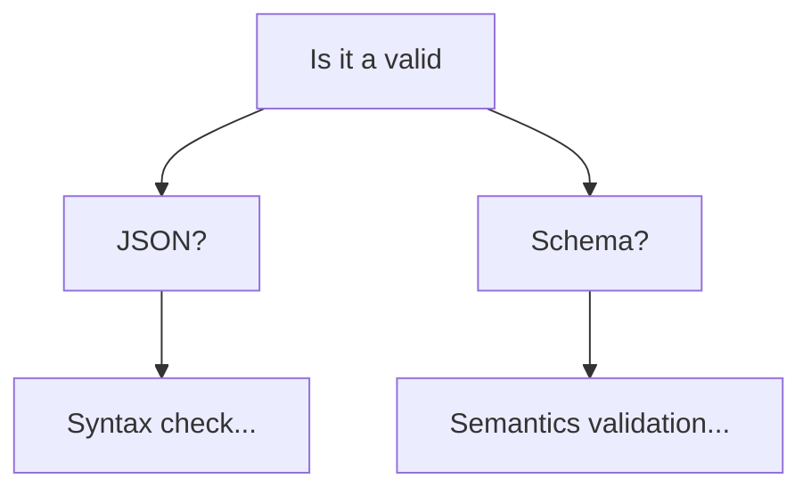

One important nuance before we get down to business: **PydanticAI itself doesn't magically force the LLM to obey a Pydantic model.** Rather, PydanticAI can take your Pydantic model and use structured-output mechanisms to constrain/validate the model's response. Depending on the model/provider and configuration, this can involve provider-native structured output, tool/function calling, or other constrained-decoding approaches.

## tl;dr

If you want to remember only one thing, remember this:

> **Pydantic defines what a valid answer looks like. The LLM's output WILL either match the schema or the LLM call will fail.**

---

## An LLM predicts Probabilities

Suppose you ask an LLM:

> Return a person with a name and age.

At each generation step, the model doesn't simply say:

> "The next token is `"`.

Instead, conceptually, it produces a probability distribution:

```text
"John"       → 0.15
"Jane"       → 0.12
"Peter"      → 0.08
"{"          → 0.07
"hello"      → 0.03
...
```

There can be thousands of possible tokens. The **decoding process** then **selects a token based on** those **probabilities**. So generation looks roughly like:



## Structured Output Adds a Constraint to that Process

Suppose you define:

```python
from pydantic import BaseModel

class Person(BaseModel):
    name: str
    age: int
```

Conceptually, you're saying:

> "The final response must have this structure."

Something like:

```json
{
  "name": "Alice",
  "age": 32
}
```

But an unconstrained LLM could produce:

```text
Alice is 32 years old.
```

or:

```json
{
  "name": "Alice",
  "age": "thirty-two"
}
```

or:

```json
{
  "foo": "bar"
}
```

So the system needs some mechanism for enforcing the schema.

## This is where Constrained Decoding comes in

Imagine the model has produced:

```json
{
  "name":
```

Now the model produces its next-token probability distribution.

Perhaps:

```text
"Alice"       40%
"Bob"         20%
"age"          5%
123            2%
"hello"        1%
"}"            1%
...
```

The structured-output system knows that, according to the schema, after:

```json
{
  "name":
```

the next thing needs to be a valid JSON value for `name`. Since `name` is a string, tokens that would make the JSON/schema invalid can be suppressed. Conceptually:

```text
Before constraint:

"Alice"   40%
"Bob"     20%
"age"      5%
123        2%
"hello"    1%

             ↓ constrained decoding

After constraint:

"Alice"   40%
"Bob"     20%
"age"      0%
123        0%
"hello"    1%
```

The invalid possibilities are given probability **0**. Then the model chooses from what remains. They zero out the probability of any token that it could generate that would break the spec.

## It Happens at Every Generation Step

This is the key idea. It isn't necessarily:



Instead, with true constrained decoding, it's more like:



At every token:



So if the schema says:

```python
class User(BaseModel):
    name: str
    age: int
```

The decoder can constrain the generation according to the grammar/schema.

## Think of it as a Traffic Cop

A useful mental model is that **without structured output** the LLM is driving wherever it wants:



But **with constrained decoding** there's a traffic cop:



The model still decides **which valid thing it wants to say**. The constraint system decides **which things it is allowed to say**. That's an extremely important distinction.

## Where does Pydantic Fit

Pydantic is primarily a **Python data validation/schema system**. You define:

```python
class Weather(BaseModel):
    city: str
    temperature: float
    raining: bool
```

Pydantic understands this as a schema approximately like:

```json
{
  "type": "object",
  "properties": {
    "city": {
      "type": "string"
    },
    "temperature": {
      "type": "number"
    },
    "raining": {
      "type": "boolean"
    }
  },
  "required": ["city", "temperature", "raining"]
}
```

That schema can then be given to an LLM integration. PydanticAI sits on top of this idea. For example, conceptually:

```python
from pydantic import BaseModel, Field
from pydantic_ai import Agent
from enum import Enum


class WeatherCondition(str, Enum):
    SUNNY = "sunny"
    CLOUDY = "cloudy"

class Weather(BaseModel):
    city: str = Field(description="The name of the city")
    temperature: float = Field(examples=[1.5], description="The temperature in degrees Celsius")
    condition: WeatherCondition = Field(description="The weather condition")

agent = Agent(
    "some-model",
    output_type=Weather,
    retries={'output': 3},
)
```

BTW schema constrains can be description, examples, enums, and other form of guides. You're telling the agent:

> The output I'm interested in is a `Weather` object with the schema I described above.

---

## An Important Distinction, Generation vs Validation

This is where explanations of structured output sometimes become confusing. There are **two different things** that can happen.

### Approach A: Generate, then Validate

The LLM produces:

```json
{
  "city": "Berlin",
  "temperature": "10",
  "condition": "rainy"
}
```

Then Pydantic says:

```text
❌ temperature isn't a float
❌ condition value isn't a valid option in the enum
```

The output is rejected. That's **validation**. And if we configure the framework (in this case it is PydanticAI) it will retry the generation (learn more [here about retries for structured output budget](https://pydantic.dev/docs/ai/core-concepts/agent/#how-output-retries-are-enforced)).

### Approach B: Constrain Generation

The model is prevented from generating certain invalid structures in the first place. For example when LLM is trying to find a value for the `"temperature"` field, the decoder knows it needs a floating point number, so possibilities are constrained toward a valid float value. That's **constrained decoding**. These mechanisms can be combined.

Why this matters? Imagine you have:

```python
class Person(BaseModel):
    name: str
```

A validator can tell you: "This response is invalid".

But it doesn't necessarily stop the LLM from generating the invalid response. Constrained decoding attempts to prevent invalid generations during generation. To visualize this you can think of it like this:



Another interesting technical details is that LLMs don't necessarily generate:

```json
{ "name": "Alice" }
```

As individual words/characters. They generate **tokens**. For example, a tokenizer might split text into pieces and the exact tokenization depends on the model. For example I am [tokenizing using gpt2](https://tokenizer.model.box/?model=gpt2):


So the constraint system has to reason about:

> "Given everything generated so far, which next tokens can possibly lead to a valid completion?"

That's substantially more sophisticated than simply checking whether the final answer is valid JSON. More importantly any valid JSON does not mean it will be automatically a response which matches the schema. If I had to put it another way I would say we have the two and both needs to be satisfied:



> [!NOTE]
>
> The exact enforcement mechanism depends on the model/provider. This is important because **not every LLM API implements structured output in exactly the same way**. Some APIs support native JSON Schema constraints. Others use tool/function calling. Some systems implement grammar-based constrained decoding themselves.

So is the LLM actually "forced"? **Sometimes literally, sometimes practically.** This is probably the most important thing to understand about structured output. If the underlying provider supports **hard constrained decoding**, then the generation process can genuinely prevent certain token sequences from being generated. But if you're using something like:

> "Please return JSON matching this schema"

**In the prompt**, that's **not enforcement**. That's just instruction-following. And you must not expect it to do what you asked it. This is specially true about smaller models. The nice thing about structured output is that we don't have to teach the LLM: "Never produce invalid JSON".
