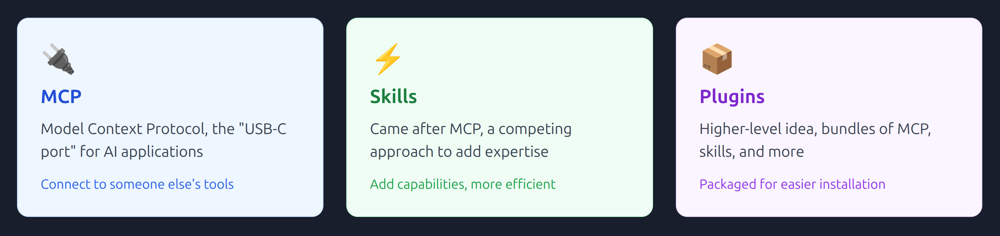
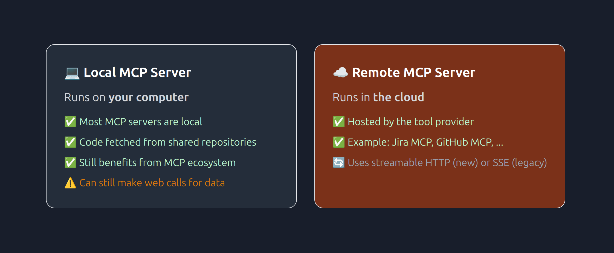
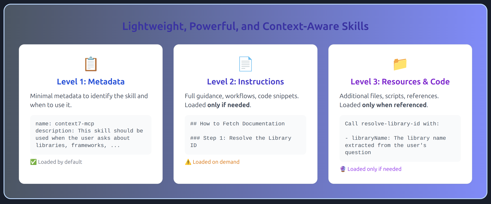
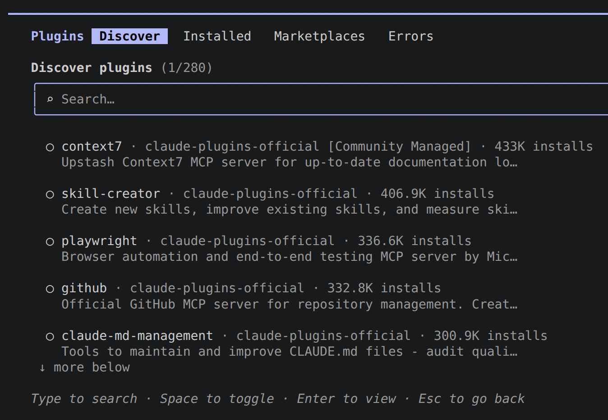

You might have heard of skills, plugins, and MCPs. But if you have not I guess if I had to put explain it in 10 seconds I would say:



I would also like to just remind you that the real innovation was when LLMs started to move from being soly a token predictor to something that feels like agentic AI. In other words instead of generating content LLMs now can take actions such as surfing the web or creating files/directories.

---

## [Model Context Protocol -- MCP](https://www.anthropic.com/news/model-context-protocol)

So we initially had and still it is around, what is called [LangChain](https://www.langchain.com/). So we wanted to be able to just bolt tools into coding agents, does NOT matter if it is someone else's tools. That is when Anthropic introduced MCP which is an open-source standard for connecting AI applications to external systems.

To summarize MCP took of because it was and is:

- Easy way to stitch in someone else's tools.
- Easy to make your own tool available to others.
- Plug and play.
- Adopted by the community.

> ⚠️ **Downside**
>
> They can fill up your context window real quick even though coding agents are smart enough to only load tools they will be needing. But still it is a risk you need to keep in mind.

> 💡 **Pro Tip**
>
> I believe you also agonized over outdated code generated by LLMs, or outdated assumptions. The reason is that when they were trained they just used the docs at that time. So you might wanna add an MCP tool called [Context7](https://mcp.so/servers/context7-mcp). It enables LLMs to read the latest docs instead.
>
> So now you imagine you can prompt it like "Add a new GraphQL API for login using PassportJS and JWT tokens, **use context7**." to make sure LLM is going to use the MCP.

### MCP Architecture -- Host, Client, Server

```
┌──────────────────────────────────────────────────────────────────────────────┐
│ 🏢 MCP Host                                                                  │
│                                                                              │
│ The AI application that needs to call tools.                                 │
│                                                                              │
│ Examples: Claude Code, ChatGPT, OpenCode, etc.                               │
│                                                                              │
│  ┌────────────────────────────────────────────────────────────────────────┐  │
│  │ 🔗 MCP Client                                                          │  │
│  │                                                                        │  │
│  │ The component inside the MCP host that speaks the MCP protocol and     │  │
│  │ connects to MCP servers on behalf of the host.                         │  │
│  └────────────────────────────────────────────────────────────────────────┘  │
└──────────────────────────────────────────────────────────────────────────────┘

┌──────────────────────────────────────────────────────────────────────────────┐
│ 💻 MCP Server                                                                │
│                                                                              │
│ A service that exposes tools, data, or resources (e.g., databases, APIs,     │
│ filesystems) to AI applications through the MCP protocol.                    │
└──────────────────────────────────────────────────────────────────────────────┘
```

On a related note it is good to know MCP servers can run in two different transport modes:



### Finding MCP Servers

Unlike app stores, there's no single place to find MCP servers. Here are the main options:

- [glama.ai](https://glama.ai/).
- [mcp.so](https://mcp.so/).
- You can look at [this GitHub repo](https://github.com/modelcontextprotocol/servers) listing some MCP servers.
- [Official MCP Registry](https://registry.modelcontextprotocol.io/).

> ⚠️ **The Discovery Problem**
>
> - Always go to the source, check the GitHub repository for stars, recent activity, and issues to have a overall understanding of it.
> - Similar to VSCode extension where we have the same extension with similar names. In those situations make sure the author is the original one.

---

## Skills

Skills are instructions as Markdown files that you can give to coding agents. They address the context window issue. You can consider it a step in a better direction. They are cleaner and more elegant for many use cases. The complexity of MCP (spawning separate processes, plumbing, etc.) is overkill for simple tasks.

For example the skill we will have after installing Context7 as a skill would look like [this](https://raw.githubusercontent.com/upstash/context7/c3248289c2ad431a9f34849a3f3d047fc4400373/packages/opencode/skills/context7-mcp/SKILL.md).

Skills might sound fancy. But they are lightweight, and powerful only thanks to:



In Claude they are structured like this:

```
.claude/                         # Can be in home (~/.claude) or project root
└── skills/                      # Must be exactly named "skills"
    └── some-skill/              # Each skill has its own directory
        ├── SKILL.md             # Contains metadata + instructions
        ├── scripts/             # Optional: scripts Claude can run
        |   ├──  do-something.py
        └── resources/           # Optional: additional reference files
            └── advanced-guide.md
```

As you can see skills either live in a repo or they are installed globally. But if you add a skill which needs to be installed you might need to either ask LLM to install them for you or you should install them manually. So this is especially important when you commit the `.claude` dir in your [VCS](https://git-scm.com/book/en/v2/Getting-Started-About-Version-Control).


### How It Works

1. Load metadata: coding agent reads the name and description of all available skills.
2. Parse your request: coding agent tries to match what you're asking with skill descriptions.
3. Load instructions: if a match is found, it loads the full `SKILL.md`.
4. Reference resources: if the instructions mention files or scripts, they're loaded/run as needed.

---

## Plugins

Basically we package MCP, skills, commands, and agents together in plugins. A bundle of features that can include:

- MCP Servers.
- Skills.
- Commands.
- Agents.

### Claude Code Plugins

You can find and [see plugins we have in Claude](https://github.com/anthropics/claude-plugins-official). For Claude you can also install and check what you have by running `/plugin` when you opened claude:



BTW plugins as of now (2026.08.23) are categorized into two category:

- `plugins/`: official Anthropic-authored plugins.
- `external/`: third-party plugins (Context 7, GitHub, GitLab, Playwright, Slack, Stripe, Supabase, etc.).

BTW initially you have a single marketplaces in Claude code, but you can add more. Just make sure they are trustworthy. Another fun fact about plugins in Claude when you are in CLI, it shows the most famous ones on top. So feel free to over over them and install what you think looks good.
