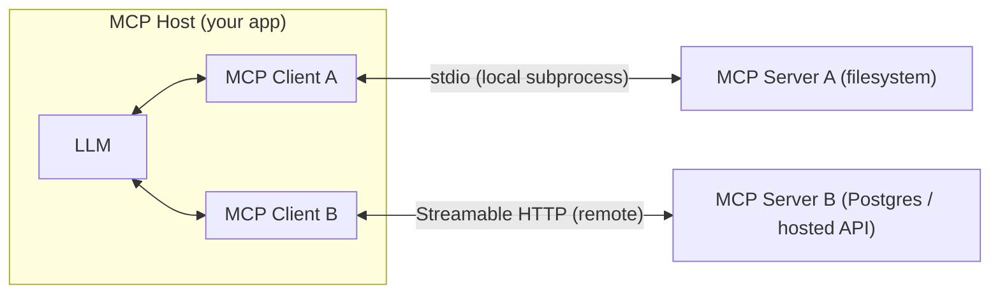

In this post I'd like to talk about what MCP's architecture actually is, what's safe to do in a notebook that you should **not** do in production, a working example with PydanticAI, and transport mechanisms you'll actually meet in practice.

## MCP Host, Client, Server

MCP (Model Context Protocol) standardizes how an LLM application gets access to tools, resources, and prompts that live outside the model itself. There are three roles:

- **Host** is the application the user talks to (your agent app, an IDE, Claude Code). It owns the LLM call and decides which servers to connect to.
- **Client** lives _inside_ the host, one per server connection. It speaks the MCP protocol ([JSON-RPC 2.0](https://modelcontextprotocol.io/specification/2025-03-26/basic#messages)) to exactly one server and keeps that session's state.
- **Server** is a separate process or service that exposes tools/resources/prompts (e.g. "read a file", "run a SQL query", "search the web"). It doesn't know anything about the LLM, it just answers protocol requests.

The point of the split: your agent framework (PydanticAI, the OpenAI Agents SDK, LangGraph, Mastra, …) only has to implement the **client** side once. Any MCP-compliant **server** written by anyone, in any language plugs into any MCP-compliant host without custom glue code.



One client maps to exactly one server. If your agent uses three tool servers, the host holds three clients, each with its own session and its own transport.

## How to Experiment with MCP Locally or in Jupyter Notebook

You'll see server configs like this constantly in tutorials:

```python
{"command": "npx", "args": ["-y", "tavily-mcp@latest"], "env": {"TAVILY_API_KEY": key}}
{"command": "uvx", "args": ["mcp-server-fetch"]}
```

`npx -y <pkg>` and `uvx <pkg>` both mean the same thing for their ecosystem: "fetch this package from the registry right now and run it, don't bother installing it into the project". That's exactly what you want in a Jupyter Notebook or a quick local experiment, zero setup, always the latest version, nothing left behind.

**BUT** this is **not** what you want once the app is something you deploy and operate:

| Concern            | Local / notebook (`npx -y`, `uvx`)                     | Production                                                                                                                              |
| ------------------ | ------------------------------------------------------ | --------------------------------------------------------------------------------------------------------------------------------------- |
| Version            | It is fine to not pin it to a specific version         | Judgment call, see below                                                                                                                 |
| Network dependency | Fine to hit npm/PyPI at startup                        | We should NOT depend on a third-party registry being up, similar to what you would do in your NodeJS app                                |
| Scope              | Usually root of the current dir, unrestricted access   | Scope tightly to a specific directory, read-only where possible, run the server in its own sandboxed/least-privileged process/container |
| Process lifecycle  | Spawned per notebook cell, killed when the kernel dies | Needs supervision, restart on crash, health checks, logs shipped somewhere                                                              |
| Secrets            | `.env` file next to the notebook is fine               | Injected via your normal secret manager (not baked into an image or checked into config)                                                |

Rule of thumb: `npx -y` / `uvx` are a package manager's "just run it" shortcut. Great for answering "does this tool even work", bad as a production dependency-pinning strategy. When you go to production, run it as a supervised subprocess, and think about the version deliberately instead of defaulting to `latest`.

### Should you pin the version?

This is the same tradeoff as pinning any npm/pip dependency, it's a judgment call, not a blanket rule:

- **Pin** specialized or niche MCP servers, especially ones from smaller vendors that change frequently. You don't want a silent upstream change to alter the tools your agent relies on without you noticing.
- **Track latest** for mainstream MCP servers built on top of fast-moving products (a browser, Google Docs, etc.). Microsoft, for example, updates Playwright often, and pinning your MCP server to an old version can leave it talking to a Chrome build the server no longer supports. Forcing everyone using the server onto your pinned version isn't realistic either.

Either way, know which one you're doing. `npx -y pkg@latest` and `npx -y pkg` are both "unpinned", if you want reproducibility, pin an exact version (`pkg@1.2.3`), and if you want that pin to live somewhere reviewable, put it in a `package.json` you commit, as shown next.

## Example

PydanticAI's MCP client is `MCPToolset`. It infers the transport from what you pass it: a `command` gives you a stdio subprocess, a `url` gives you an HTTP-based connection. So I'd create a tiny NodeJS project whose only purpose is to own the MCP server dependencies:

```text
some-agent/
├── pyproject.toml
├── uv.lock
├── package.json
├── package-lock.json
└── src/
    └── agent.py
```

Then instead of using `npx -y ...` directly, I'd `npm install @modelcontextprotocol/server-filesystem` and commit both `package.json` and `package-lock.json` to the repository. Then our Python code can invoke the locally installed binary, rather than asking npm to dynamically resolve a package:

```python
import asyncio

from pydantic_ai import Agent
from pydantic_ai.mcp import MCPToolset

# Stdio transport:
# PydanticAI spawns this as a subprocess and talks to it over stdio.
docs_server = MCPToolset(
    command="npx",
    args=[
        "--offline",
        "@modelcontextprotocol/server-filesystem",
        str(Path("docs").resolve()),
    ],
)

agent = Agent(
    "openai:gpt-5.2",
    instructions="Answer questions using only the files you can read via your tools.",
    toolsets=[docs_server],
)


async def main():
    async with agent:  # opens the MCP session(s) for the duration of the run
        result = await agent.run("What does docs/setup.md say about environment variables?")
        print(result.output)


if __name__ == "__main__":
    asyncio.run(main())
```

Things worth noting:

- Another option is to drop the whole installing and instead just invoke the binary directly:
  ```py
  docs_server = MCPToolset(
      command="node",
      args=[
          "./node_modules/@modelcontextprotocol/server-filesystem/dist/index.js",
          str(Path("docs").resolve()),
      ],
  )
  ```
- `async with agent:` opens and cleanly tears down every toolset's MCP session around the run so we don't have to manage the subprocess lifecycle manually.
- Because the server is scoped to `./docs`, the agent can read files inside that folder and nothing else. That's the "scope tightly" suggestion. Don't point a filesystem server at `.` or `/` unless you've deliberately decided the agent should have access to everything under it. And even then I guess you would be better off sandboxing such agents.

> [!TIP]
>
> Honestly I have not tried this one yet to know how much better or worse it would be. But I guess you can also try:
>
> | `package.json`                                                                                                                                                                                                               | `src/agent.py`                                                                                      |
> | :--------------------------------------------------------------------------------------------------------------------------------------------------------------------------------------------------------------------------- | :-------------------------------------------------------------------------------------------------- |
> | `{`<br>`  "private": true,`<br>`  "dependencies": {`<br>`    "@modelcontextprotocol/server-filesystem": "2026.8.31"`<br>`  },`<br>`  "scripts": {`<br>`    "mcp:filesystem": "mcp-server-filesystem ./docs"`<br>`  }`<br>`}` | `docs_server = MCPToolset(`<br>`    command="npm",`<br>`    args=["run", "mcp:filesystem"],`<br>`)` |

## Two Transports: `stdio` vs. Streamable HTTP

MCP defines how client and server _talk_, independent of what the server does. In practice you'll use one of two transports. And keep in mind the transport mechanism is inferred based on whether a `url` or `command`/`args` is passed.

### `stdio` -- Standard Input/Output

- The client **spawns the server as a local subprocess** and exchanges JSON-RPC messages over its stdin/stdout pipes.
- No network, no ports, no auth needed. The OS process boundary is the security boundary.
- Requires the server's runtime (NodeJS, Python, a binary) to be installed wherever your host process runs.
- Natural fit for: local tools (`filesystem`, `git`, a local database file), or a server you build and ship inside your own deployment image.
- Pass `command`/`args` to the `MCPToolset` constructor.

### Streamable HTTP

- The client connects to a server that's already running somewhere, over HTTP, using a single endpoint that supports both request/response and server-initiated streaming (this is the current MCP standard transport).
- The server is a separate, independently deployable, independently scalable process. It can serve multiple clients/hosts at once, live behind normal HTTP infra (load balancers, auth gateways, TLS).
- Auth is a first-class concern: bearer tokens, OAuth, or custom headers travel with each request, the same way they would for any HTTP API.
- Natural fit for:
  - A shared internal tool server.
  - A third-party MCP server run by a vendor.
  - Anything you don't want to spawn and supervise as a local process per agent instance.
- Pass a `url` instead of a `command`.

```python
from pydantic_ai.mcp import MCPToolset

remote_docs = MCPToolset(
    "https://mcp.internal.example.com/docs",
    headers={"Authorization": f"Bearer {api_token}"},
)
```

### Choosing between them

|                                | stdio                                                           | Streamable HTTP                                                                |
| ------------------------------ | --------------------------------------------------------------- | ------------------------------------------------------------------------------ |
| Where the server runs          | Same machine, spawned per host process                          | Anywhere, long-lived, independent of the host                                  |
| Scaling / sharing across hosts | No, one subprocess per host instance                            | Yes, one deployment serves many hosts                                          |
| Network exposure               | None                                                            | Needs auth, TLS, rate limiting like any API                                    |
| Operational overhead           | Process supervision on every machine that runs the host         | Normal service deployment (once), consumed everywhere                          |
| Typical use                    | Local dev, sandboxed local tools, servers bundled with your app | Production tool servers, third-party/vendor MCP servers, anything multi-tenant |

In short use stdio for anything that genuinely needs to be local (a sandboxed code-execution server, filesystem access scoped to a container), and Streamable HTTP for anything shared. For example a company-wide search or database tool server that many agent instances hit concurrently.
