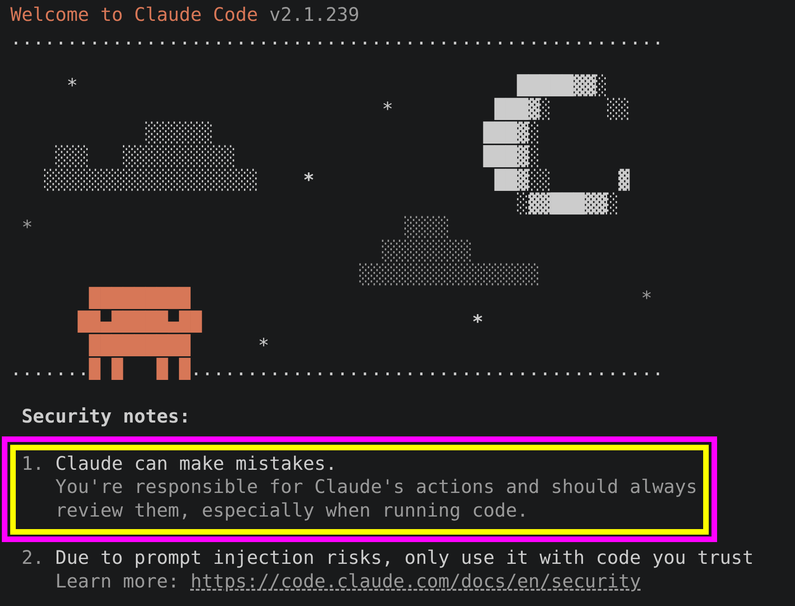

I sometimes hear about vibe coding and honestly I do NOT believe you as a professional developer need to do it. The journey of using LLMs is interesting, it's useful, you pick up new skills. BUT I wish devs would not stop there and go deeper, get more pro and know what LLM is doing/writing.

I read [Vibe Engineering](https://simonwillison.net/2025/Oct/7/vibe-engineering/) post from Simon Willison. There he says:

> I feel like **vibe coding** is [pretty well established now](https://simonwillison.net/2025/Mar/19/vibe-coding/) as covering the fast, loose and irresponsible way of building software with AI—entirely prompt-driven, and with no attention paid to how the code actually works. This leaves us with a terminology gap: what should we call the other end of the spectrum, where seasoned professionals accelerate their work with LLMs while staying proudly and confidently accountable for the software they produce?

And I wholeheartedly agree with him. It's about being **highly productive**, **highly effective**, and **impactful** whilst keeping **accountability** for the code you build. Doing it in a **bulletproof** way.

## tl;dr

> If you're going to really exploit the capabilities of these new tools, you need to be operating at the top of your game. You're not just responsible for writing the code—you're researching approaches, deciding on high-level architecture, writing specifications, defining success criteria, [designing agentic loops](https://simonwillison.net/2025/Sep/30/designing-agentic-loops/), planning QA, managing a growing army of weird digital interns who will absolutely cheat if you give them a chance, and spending so much time on code review.

You are responsible for what LLMs generate:

*Happy engineering.* 🚀

---

## The Evolution of AI Coding 🐒➡️🧍

So I believe we all started from vibe coding, then start to see the short comings and became skeptical. That was when I believe most of us started to "plan, execute, and review" what LLMs write as oppose to YOLO mode where you just let LLM do whatever. But for me the key takeaway is (from the *Jellyfin* post):  

> The golden rule is this: **do not just let an LLM loose on the codebase with a vague vibe prompt and then commit the results as-is**. This is lazy development, will **always** result in a **poor-quality contribution** from our perspective, and we are not at all interested in such slop. **Make an effort** or please do not bother. And again, you are free to use LLMs to assist you, but not as the sole source of code changes.
>
> &mdash; [Ref](https://jellyfin.org/docs/general/contributing/llm-policies/).

In short it is **your job** and **my job** to deliver code that we are **accountable** for.

## The Vibe Engineering Mindset

- ✅ **Automated testing**: write and make sure to write tests who are valuable and serve as a spec for your code.
- ✅ **Planning in advance**: make sure to write a `plan.md` always and review it first. There you can break a big task into smaller chunks and potentially you can finish each step separately in a fresh context window (although you might wanna read [this gist about costs](https://gist.github.com/kasir-barati/38da1204d1aa79e2cce487df4a1cf220/) first).
- ✅ **Comprehensive documentation**: make sure to document what matters and do NOT let LLMs to write whatever they wanted. In my experience they tend to go rogue and just write a ton o stuff. Make sure to look at my [AGENTS.md](https://gist.github.com/kasir-barati/7de961cbbefb8f18bb8683cade5773f5).
- ✅ **Good version control**: in Claude they just create snapshots (essentially they are just git stashes) before making changes after receiving a prompt. We can do it too, e.g. when you wanna diverge and make a drastic change you can stash your changes and then refactor.
- ✅ **Code review**: make the LLM review its own work. Usually you might wanna ask a different LLM to do the code review. So you are getting a second opinion.
- ✅ **A weird form of management**: getting good results feels like managing a human collaborator, but with quirks.
- ✅ **Manual QA**: don't rely only on automation entirely. Test things yourself before asking QA team to take over.
- ✅ **Strong research skills**: when you hit a wall, step back and try a different approach. Try to start fresh, it really sometimes can help. You cn see a prime example of this [here](https://gist.github.com/kasir-barati/38da1204d1aa79e2cce487df4a1cf220/).
- ✅ **Instinct for what to keep an eye on**, when we have:
  - A pretty standard **frontend** we can delegate freely. The LLM will build it, you give feedback, it improves.
  - But **Backend** is different beast. LLMs often struggle, make bad design decisions, violate DRY principle, use tools that are not the best options out there.
  - Also writing sensible tests sometimes prove to be difficult for LLMs.

## Estimating Tickets/Features

In [software 1.0](https://www.mindstudio.ai/blog/software-1-0-2-0-3-0-ai-programming-paradigm) we had most of the times a got feeling & some criteria as to how to estimate how much effort goes into developing it. But now we have LLMs which can generate 5000 lines of code in minutes until you hit a road blocker such as LLMs going rogue, a complicated/complex feature is not working due to some tiny decision LLM made (in short it is a logical issue).

**So do NOT get caught up in the hype about 10x productivity boost**.
