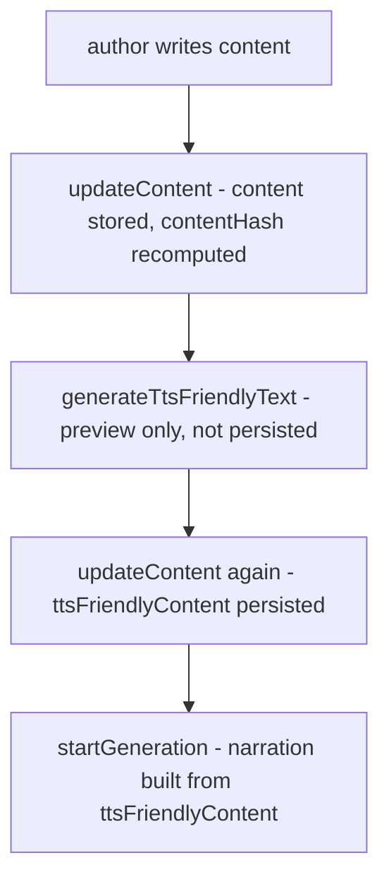

Imagine you have a [`ChapterContent`](https://github.com/kasir-barati/smart-novel/blob/7ef4d9f25bbeac9e3226b9009f76d74505f4147b/apps/backend/prisma/schema.prisma#L66-L67) table in PostgreSQL:

```prisma
model ChapterContent {
  // ...
  content            String  @db.Text
  ttsFriendlyContent String? @map("tts_friendly_content") @db.Text

  contentHash String  @map("content_hash")
  ttsHash     String? @map("tts_hash")
  // ...
}
```

I initially though what an ingenious thing I did, two `String` columns, sitting next to each other, where the `ttsFriendlyContent` only makes sense as a function of `content` and that invariant lives entirely in application code, spread across codebase, instead of being enforced by the data model.

> [!NOTE]
>
> When I say "function" I mean it in the mathematical sense: `ttsFriendlyContent = f(content)`, its value should be entirely determined by content (plus a bunch of rules we have for it, e.g. not using ~ for elongations). Given the same content, there's only one correct ttsFriendlyContent; it's not meant to be an independent value someone can set arbitrarily.
>
> That's why storing it as its own free-standing column (rather than as a computed/derived artifact) is a design smell, the schema lets you set it to anything, even though semantically it should only ever be "whatever content maps to". And another relevant issue is maintaining it.

## The Invariant Nobody can See

The rule I actually need enforced is simple to state and hard to find:

> You must generate `ttsFriendlyContent` from `content` before you can generate narration audio from `ttsFriendlyContent`. You cannot set `ttsFriendlyContent` without `content` already existing. If `content` changes, `ttsFriendlyContent` becomes stale and narration built from it is now wrong too.

None of that is expressed by the schema. It's enforced (partially) by scattered checks:

- [`ChapterService#updateContent#updateContent`](https://github.com/kasir-barati/smart-novel/blob/7ef4d9f25bbeac9e3226b9009f76d74505f4147b/apps/backend/src/modules/novel/services/chapter.service.ts#L42-L63) accepts `content` and `ttsFriendlyContent` as **two independent, client-supplied strings** in the same call, with a `TODO` admitting the obvious hole 😅:

  ```ts
  // TODO: validate the ttsFriendlyContent make sense (the content should match the TTS-friendly version)!
  ```

  ```mermaid
  sequenceDiagram
    actor Client
    participant API as GraphQL API
    participant Service as ChapterService#updateContent
    participant Repo as ChapterContentRepository

    Client->>API: mutation (cnt: "He", ttsFriendlyCnt: "asd")
    Note over Client: Cannot use equality checks!

    API->>Service: updateContent(chapterId, content, ttsFriendlyContent)
    Note over Service: Already too late to validate

    Service->>Repo: upsertByChapterId(chapterId, content, ttsFriendlyContent)
    Note over Repo: Does NOT validates ttsFriendlyContent either

    Repo-->>Service: stored ✅ (silently wrong)
    Service-->>API: chapter
    API-->>Client: 😵 200 OK
  ```

  You ask why we **cannot use equality checks?** Because one is suppose to the the text user sees while the other is a a machine-generated version of the content.

  And just in case you are wondering why I wrote "too late to validate", I meant that validation should have been done when we received the request (DTO layer).

- Right now there's exactly one door into [updating `ChapterContent`'s `content` and `ttsFirendlyContent` fields](https://github.com/kasir-barati/smart-novel/blob/7ef4d9f25bbeac9e3226b9009f76d74505f4147b/apps/backend/prisma/schema.prisma#L64), the good thing is that client must send both fields every time, so the "set ttsFriendlyContent before content exists" scenario can't happen. It only becomes a real ordering problem [if we add `createChapter` mutation](https://github.com/kasir-barati/smart-novel/blob/7ef4d9f25bbeac9e3226b9009f76d74505f4147b/apps/backend/src/modules/novel/resolvers/chapter.resolver.ts#L80-L100): then a chapter could exist with `content` but no `ttsFriendlyContent`, and a later `updateContent` call would need to know whether it's being asked to set `ttsFriendlyContent` for the first time, edit `content`, or both! Drawing a line between them is costly and very much error-prone.

  ```mermaid
  sequenceDiagram
    actor Client
    participant API as GraphQL API
    participant Svc as ChapterService

    Note over Client,Svc: Today - updateContent is the only mutation touching chapter_contents table, both args required together
    Client->>API: updateContent(id, content, ttsFriendlyContent)
    API->>Svc: writes both fields in one call - no way to send just one

    Note over Client,Svc: Hypothetical - if createChapter ships as its own mutation
    Client->>API: createChapter(content)
    API->>Svc: chapter row created, ttsFriendlyContent still null
    Client->>API: updateContent(id, content, ttsFriendlyContent)
    Note over Svc: this second call could also silently change content again
  ```

- [`PrismaChapterContentRepository#upsertByChapterId`](https://github.com/kasir-barati/smart-novel/blob/7ef4d9f25bbeac9e3226b9009f76d74505f4147b/apps/backend/src/modules/novel/repositories/prisma-chapter-content.repository.ts#L45-L70) recomputes `contentHash` from `content` on every write, but **never touches `ttsHash`**. The column exists, it's indexed ([`schema.prisma#L89`](https://github.com/kasir-barati/smart-novel/blob/7ef4d9f25bbeac9e3226b9009f76d74505f4147b/apps/backend/prisma/schema.prisma#L72)), it's read back in the repository mapper, but nothing ever writes or compares it.

  It's a staleness-detection mechanism that was designed and I did not get to finish it, but the point is that the two-fields-as-siblings shape doesn't naturally produce a "check if stale" step; you have to bolt it on and remember to call it everywhere.

- [`ChapterNarrationService#startGeneration(chapterId, forceRegenerate)`](https://github.com/kasir-barati/smart-novel/blob/7ef4d9f25bbeac9e3226b9009f76d74505f4147b/apps/backend/src/modules/novel/services/chapter-narration.service.ts#L66-L171) layers on Redis locking, in-flight HTTP-request cancellation, and a double-checked-locking re-read of the DB, all to answer one question safely: _is the narration we're about to build actually derived from the current content?_ This is a lot of concurrency machinery compensating for the fact that the data model can't say "this narration is derived from commit X of this content" on its own.

## Why this is Hard to Maintain

None of these four pieces is complicated in isolation. The problem is that the actual business rule, _content → tts-friendly text → narration, each derived and invalidated by the previous step_ is nowhere written down as a single flow and they are scattered across multiple mutations. Miss any one piece when adding a new mutation path or changing one, and you get either a rejected valid request or worse narration audio generated from stale text, with no error at all.

Here's the actual authoring workflow that demonstrates the crux of the matter:



The flow is of mutations is far apart in time and they all work on the same `content` and `ttsFriendlyContent` fields. It is very easy to break the flow and introduce bugs when developing new features, fixing a bug, or refactoring.

## The Potential Fixes

1. The textbook answer here is [derived/generated columns](https://www.postgresql.org/docs/current/ddl-generated-columns.html) or a version/lineage table which stores `content`, and `content_version`, then the `tts_friendly_content` (and `narration`) fields reference the exact version they were derived from, so staleness is a join/comparison instead of a hash which is maintained at the application level (imagine we had implemented it and use the `ttsHash`) prone to human-errors or application-level bugs.

   This is the same shape as [event sourcing/CQRS read-model invalidation](https://martinfowler.com/bliki/CQRS.html) or a plain [content-addressable cache](https://en.wikipedia.org/wiki/Content-addressable_storage): never overwrite a derived artifact in place, key it by the hash of its source, and treat a hash mismatch as "recompute," not as a manual flow someone else has to remember to do.

2. **Stop maintaining `ttsFriendlyContent` as hand-sanitized text all together.** Instead of a regex pass + LLM normalization step that produces a _separate stored string_ someone has to keep in sync, I'm going to hand the raw `content` straight to [Qwen3-TTS](https://github.com/QwenLM/Qwen3-TTS) with instructions in the prompt for how to handle markdown, elongated words, ALL-CAPS, bracketed sound cues, etc. Instead of normalizing the content first at generation time, not persistence time.

   This doesn't fix the schema design mistake in a principled way. I am sidestepping it by deleting the second field that had to stay in sync. There's only one source string now (`content`), and "TTS-friendly" becomes an instruction send to [Beatrice's `generateAudio` mutation](https://kasir-barati.github.io/smart-novel-beatrice/v3.0.0/#mutation-generateAudio). The instructions can be as rigid as a hardcoded string we can embed in the mutation itself, or as flexible as enabling authors to customize how Beatrice handles their content when it wanted to generate audio. Fewer fields, fewer hashes to forget to update, fewer maintenance taxes.

**Long story short I decided to go with the second option.**

The proper fix, content-addressable derived rows with explicit lineage is still the right answer if a project needs auditable, cacheable, multi-version derived content. **For a single-author, single-version chapter model, removing the second field is cheaper than making the sync mechanism correct**. Also keep in mind here we are talking about novels and chapters. So it should not be that big of a deal.

> [!CAUTION]
>
> I had a nasty experience with dev.to itself when I was using their platform to update my posts and then they just mixed it and my post was half old content and half new content. That was a disaster and why I decided to move to a more stable, local, and disciplined approach which was using a Version Control System. Currently I write my posts locally on my lovely Zed IDE and push them to GitHub, then there is a GitHub Actions which automatically publishes the posts to dev.to or schedule it.
>
> I guess I am very much fond of the same pattern for smart-novel. AKA authors can write on their own local machines and push them to some sort of VSC. But the only issues is that they are most of the times not into tech. But I believe with LLMs and right amount of tooling I can make it easier for them to write their novels. I am thinking of having a MCP server which would exposes a couple of skills helping them register at GitHub, create a repository, add secrets and necessary env vars. So the nitty-gritty details are hidden away from the non-tech authors.
>
> And of course they can still use the beautiful UI to update their posts. But I guess this demands a bit more brainstorming since I already had tried a couple of times to update my dev.to posts in their UI since it was a single line change. But then I remembered that would corrupt my post in my GitHub repository since now I have a change which does not exists in the VCS. If by any chance I update the markdown file in my repo and push it, it will override the changes I made in the dev.to UI.

---

GitHub Repos:

- [smart-novel is a novel writing platform which addresses frustrations I had when visiting and reading other website to read novel online](https://github.com/kasir-barati/smart-novel).
- [Beatrice is the companion LLM-powered app for smart-novel](https://github.com/kasir-barati/smart-novel-beatrice).
