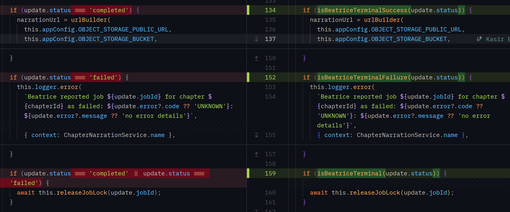
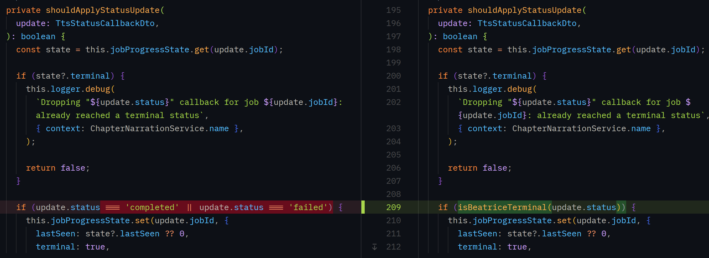
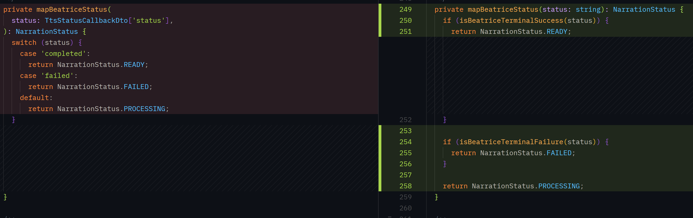

An anti-corruption layer (ACL) is a translation boundary between two systems that don't share a domain model, **typically** your service and an external one you don't control. Instead of letting the external system's types, vocabulary, or assumptions leak into your codebase, you translate at the boundary into a model you own, and everything past that boundary only ever speaks your vocabulary.

The term comes from [Eric Evans' _Domain-Driven Design_](https://www.goodreads.com/en/book/show/179133.Domain_Driven_Design): without this layer, changes on the other side of an integration ("corruption") propagate straight into your domain model, your control flow, and your compile-time guarantees — because your code was written in terms of their words, not yours.

I found this YouTube video useful: [Can an "Anti-Corruption Layer" save your bad software architecture?](https://youtu.be/_oAYFR-hexg)

## When to Reach for One

Not every integration needs one. Use an ACL when:

- You depend on an external system's specific vocabulary (enum values, status strings, field names) to make a decision, but you don't control when or how that vocabulary changes.
- The upstream system explicitly does not promise stability for that vocabulary (no versioned contract, no deprecation window) which is common for anything described as internal detail, not a stable public API.
- You want a drifted or renamed upstream value to degrade gracefully (log a warning, fall back to a safe default) instead of crashing validation or silently mis-branching.

You don't need one when the two systems already share a real contract (a versioned schema, a generated SDK, a GraphQL schema snapshot you control and update deliberately). smart-novel already has that pattern for Beatrice's GraphQL API itself, `apps/backend/src/shared/beatrice/schema.graphql` snapshot is downloaded at build time and it is pinned to specific version. `gql.tada` generates types from it.

Although we are deliberate about the GraphQL schema, the status vocabulary discussed here is different. It's a free-text `status` field on a webhook payload, with no such schema to pin against. So ultimately we are working with untyped strings.

## Beatrice's TTS status callback

[Beatrice's `statusCallbackUrl` posts progress updates](https://github.com/Ponos-OS/smart-novel-beatrice/blob/78168922ccf593c17f9e05f7bb8a377e73c5f73e/src/modules/audio/progress.py#L23) for an in-flight `generateAudio` job: `queued`, `generating`, `uploading`, `completed`, `failed`, and Beatrice can add more new statuses later without notice. smart-novel only ever needs to act on two of those statues. Everything else just means "still working".

### The DTO Stays Untyped

[`TtsStatusCallbackDto.status`](https://github.com/Ponos-OS/smart-novel/blob/b16fb53cc2c267f43e8ec356e9defa46a936065e/apps/backend/src/modules/tts-callbacks/dtos/tts-status-callback.dto.ts#L29) right now is typed. But it will be a plain `string`, not a literal union of Beatrice's known values. [`'transcoding'` case](https://github.com/Ponos-OS/smart-novel/blob/b16fb53cc2c267f43e8ec356e9defa46a936065e/apps/backend/src/modules/tts-callbacks/dtos/tts-status-callback.dto.spec.ts#L23) is demonstrating what I meant by Beatrice adding new statuses.

A DTO at a trust boundary should validate the shape it can actually enforce and work with, a string is not a vocabulary smart-novel can work with securely.

### The Translation Layer

[`beatrice-status.util.ts`](<>) is the ACL itself: it's the one and only place that knows Beatrice spells "done" as `'completed'` and "failed" as `'failed'`.

- `isBeatriceTerminalSuccess(status)` / `isBeatriceTerminalFailure(status)` are the two predicates every decision in the backend is built on.
- `isBeatriceTerminal(status)` check will tell you when to release the narration lock (we do not really care about success or failure here).
- `isKnownBeatriceStatus(status)` is used purely as a drift detector, **never** for control flow.

Before this change, the same three string comparisons (`update.status === 'completed'`, `=== 'failed'`) were duplicated five times across [`ChapterNarrationService.handleStatusUpdate`](https://github.com/Ponos-OS/smart-novel/blob/b16fb53cc2c267f43e8ec356e9defa46a936065e/apps/backend/src/modules/novel/services/chapter-narration.service.ts#L124-L153):

And [`shouldApplyStatusUpdate`](https://github.com/Ponos-OS/smart-novel/blob/b16fb53cc2c267f43e8ec356e9defa46a936065e/apps/backend/src/modules/novel/services/chapter-narration.service.ts#L185-L229):

Plus the `switch` in [`mapBeatriceStatus`](https://github.com/Ponos-OS/smart-novel/blob/b16fb53cc2c267f43e8ec356e9defa46a936065e/apps/backend/src/modules/novel/services/chapter-narration.service.ts#L235-L246).

If Beatrice ever renamed `completed` to `succeeded`, all five spots would silently need updating, miss one and the narration lock, the persisted audio URL, or the published subscription event would each independently disagree about whether the job was actually done. Now every one of those call sites goes through the same two predicates, so a rename is a one-line fix in `beatrice-status.util.ts`.

### What Still Crosses the Boundary as-is and Why that's Fine

[`ChapterNarrationService.handleStatusUpdate`](https://github.com/Ponos-OS/smart-novel/blob/f2ff25dc18b6343313bc3359bc216403b4307bfe/apps/backend/src/modules/novel/services/chapter-narration.service.ts#L165-L181) publishes two different things onto the `chapterNarrationUpdated` GraphQL subscription:

- `status: NarrationStatus` which is our own enum (`READY` / `FAILED` / `PROCESSING`), computed by [`mapBeatriceStatus`](https://github.com/Ponos-OS/smart-novel/blob/f2ff25dc18b6343313bc3359bc216403b4307bfe/apps/backend/src/modules/novel/services/chapter-narration.service.ts#L249-L259). This is [the field the frontend's control flow branches on](https://github.com/Ponos-OS/smart-novel/blob/f2ff25dc18b6343313bc3359bc216403b4307bfe/apps/frontend/src/components/GenerateTtsButton.tsx#L84), and it's fully insulated from Beatrice's spelling.
- [`stage: update.status`](https://github.com/Ponos-OS/smart-novel/blob/f2ff25dc18b6343313bc3359bc216403b4307bfe/apps/backend/src/modules/novel/services/chapter-narration.service.ts#L172-L174) is Beatrice's raw string, forwarded verbatim, present only while `status` is `PROCESSING`. This is intentionally _not_ translated into our own enum.

The anti-corruption layer only needs to protect the backend's own decisions (persist a URL, release a lock, log an error), not everything a human eventually reads on screen. Nothing in the backend inspects `stage` to decide anything, so Beatrice renaming `uploading` to `finalizing` tomorrow is a purely cosmetic frontend concern (an unfamiliar word shown for one release, until a display [label map](https://github.com/Ponos-OS/smart-novel/blob/f2ff25dc18b6343313bc3359bc216403b4307bfe/apps/frontend/src/components/GenerateTtsButton.tsx#L15-L19) is updated in the frontend).

In other words, the ACL's job is narrowing the _decision-making_ surface to a vocabulary smart-novel owns, not eliminating every trace of the external system's words from the codebase. A field that's purely displayed, never branched on, doesn't need translating.

### Graceful Degradation on Drift

[`handleStatusUpdate`](https://github.com/Ponos-OS/smart-novel/blob/f2ff25dc18b6343313bc3359bc216403b4307bfe/apps/backend/src/modules/novel/services/chapter-narration.service.ts#L125-L130) logs a warning when `isKnownBeatriceStatus` returns `false`. We are not rejecting the callback (it's still forwarded to the UI via `stage`, and `mapBeatriceStatus` still falls through to `PROCESSING`), it just makes the drift observable in logs instead of ignoring it. If Beatrice ever adds a new transient stage (e.g. `transcoding`), this warning is the signal to update `BEATRICE_KNOWN_TRANSIENT_STATUSES` in [`beatrice-status.util.ts`](https://github.com/Ponos-OS/smart-novel/blob/f2ff25dc18b6343313bc3359bc216403b4307bfe/apps/backend/src/modules/tts-callbacks/utils/beatrice-status.util.ts#L10-L14). And note that this is just to make sure we are maintaining our app in a way that we are not at some point starting to ignore these warnings.

## Summary

| Concern                                                         | Owned by                                       | Coupled to Beatrice's spelling?                       |
| --------------------------------------------------------------- | ---------------------------------------------- | ----------------------------------------------------- |
| DTO shape validation                                            | `TtsStatusCallbackDto.status: string`          | No — any string passes                                |
| Terminal-state decisions (persist URL, release lock, error log) | `beatrice-status.util.ts` predicates           | Yes, in exactly one file                              |
| GraphQL-facing status                                           | `NarrationStatus` enum via `mapBeatriceStatus` | No                                                    |
| UI display text                                                 | `stage: update.status` (raw passthrough)       | Yes, but harmlessly — display only, never branched on |
| Drift detection                                                 | `isKnownBeatriceStatus` + a `warn` log         | Yes, as an early-warning list, not a hard contract    |
