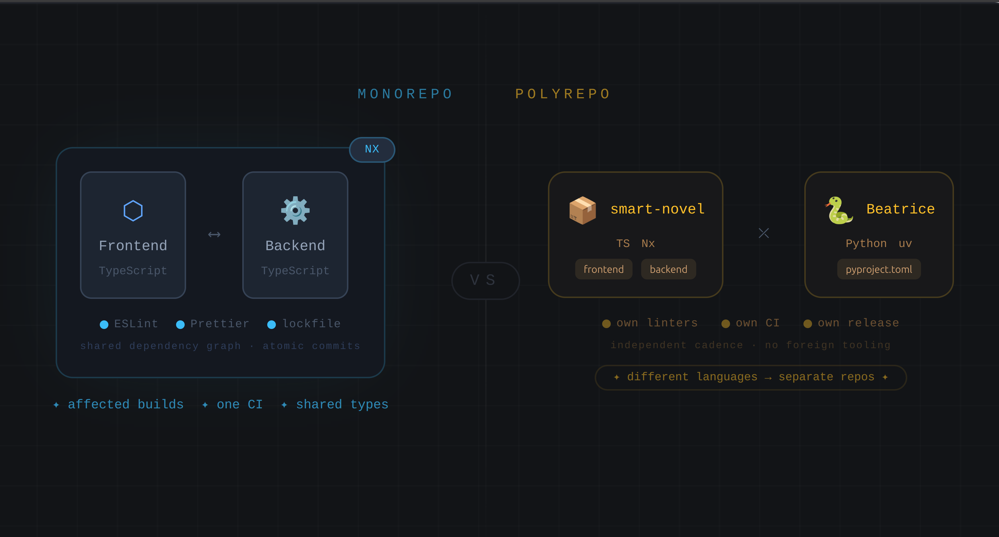

I had an technical debate about when one should "just put it all in one monorepo", and honestly at that time I was on the side of monorepo for the project in question but did not know how to reason about it. I mean I was not sure how it pays off. So that is why I did a little bit of thinking and realized we do not need to answer "are these projects related?". Almost everything in a product is related 😉.

Rather the question is: **do these projects share a toolchain, and does that sharing actually reduce friction?**

Here I decided to use my two repos from the same product to make a useful A/B test:

- [smart-novel](https://github.com/kasir-barati/smart-novel) is managed by Nx monorepo and it houses the frontend and backend
- [smart-novel-beatrice](https://github.com/kasir-barati/smart-novel-beatrice) is a standalone Python service (Beatrice), split out on purpose.

## Why Frontend and Backend Live Together

Both apps in `smart-novel` are TypeScript. That single fact cascades into a lot of shared infrastructure:

- One dependency graph, one lockfile, one version of TypeScript/ESLint/Prettier across both apps.
- Nx can build, test, and lint only what changed, across app boundaries, in a single command.
- Shared types and utilities can be imported directly instead of published as packages.
- One CI pipeline, one set of environment conventions, one place to look for config.

None of this requires the frontend and backend to be _conceptually_ simple or tightly coupled, it requires them to speak the same toolchain. Nx's whole value proposition is coordinating a graph of packages that already share a runtime and build system. Put differently: the monorepo isn't paying for "frontend and backend are part of the same product", it's paying for "frontend and backend are both TypeScript projects that Nx can reason about together."

## Why Beatrice Doesn't

Beatrice is Python, it comes with `pyproject.toml`, `uv.lock`. It has its own linters, test runner, CI/CD. None of that has anything in common with Nx's build graph. Folding it into the Nx repo wouldn't add coordination, it would add friction:

- Nx has nothing to orchestrate for a Python package. It's dead weight in the workspace config.
- A Python contributor now has to understand an Nx workspace just to find `pyproject.toml`.
- CI has to be able to work with a Python project inside a workspace tuned for another language's tooling.
- Versioning and release cadence for a Python service don't necessarily track the frontend/backend release cadence anyway.

So the separation isn't a judgment that Beatrice is "less important" or unrelated to the product, it's that gluing it to a toolchain built for a different language fights the tooling rather than helping iteration speed.

## The Actual Criteria

Boiled down, the questions that decide "same repo or separate repo" are:

1. **Do they share a build toolchain and language runtime?** If yes, a monorepo tool like Nx can add real value; shared dependency graphs, affected-only builds, one lint/format config. If no, the tool has nothing to coordinate and just adds overhead.
2. **Would merging them require one project to route around the other's tooling?** If a Python service has to sit inside a Node build graph (or vice versa), you've added a foreign-language exception to every CI/CD script, editor config, and onboarding doc, that's cost, not synergy.
3. **Do they release and version together in practice?** Two apps deployed in lockstep benefit from atomic commits across both. Two services with independent release cadences don't need that coupling, and a shared repo can make it harder to see which one actually changed.
4. **Does "related product" already imply "related tooling"?** It often doesn't. Two parts of the same product can legitimately be written in different languages for good reasons (ML tooling in Python, application layer in TypeScript), that's a reason to keep them separate, not a coincidence to design around.

