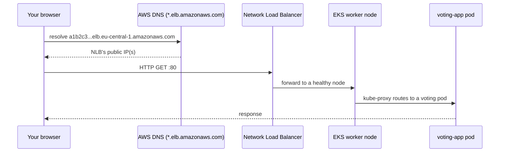
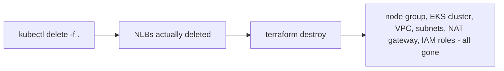

I hope now you have a fundamental grasp on the what Terraform will do. This part is about setting up the infrastructure, deploying the app, verifying it works, and tearing it all down.

## Prerequisites Checklist

- [Install Terraform](https://developer.hashicorp.com/terraform/install)
- [Install AWS CLI](https://docs.aws.amazon.com/cli/latest/userguide/getting-started-install.html)
- [Install kubectl](https://kubernetes.io/docs/tasks/tools/#kubectl)
- [Create an IAM user and access keys](https://dev.to/kasir-barati/looking-at-what-we-are-building-1flf)

## `terraform init` & `terraform plan`

```bash
git clone git@github.com:kasir-barati/docker.git
cd k8s/voting-microservice-architecture/deployment/terraform
cp terraform.tfvars.example terraform.tfvars   # optional: edit values here

terraform init
```

`init` downloads the `aws` provider and the `vpc`/`eks` modules into a local `.terraform/` folder, and writes/checks `.terraform.lock.hcl` (pins exact provider versions. This file _should_ be committed to Git, unlike state (in the repo it is already present, but I just wanted to be clear about it).

```bash
terraform plan
```

You'll get a long list ending in something like:

```text
Plan: 47 to add, 0 to change, 0 to destroy.
```

47-ish resources for "one VPC and one EKS cluster" sounds like a lot until you remember a module expands into subnets × 2 AZs, route tables, IAM roles and policy attachments, the node group's launch template, security groups, etc. Most of the times you wanna skim through it. BTW at this stage nothing has touched AWS yet.

## `terraform apply`

Same plan, followed by a `yes` confirmation prompt. This step genuinely takes a while, **EKS control planes take roughly 10-15 minutes to provision**, plus a few more minutes for the node group's EC2 instances to launch and join. This is normal; it's AWS provisioning managed infrastructure, not a Terraform slowness so feel free to grab a coffee.

When it finishes, you'll see the outputs from `outputs.tf`:

```text
Outputs:

cluster_endpoint = "https://ABCDEF1234167890.gr7.eu-central-1.eks.amazonaws.com"
cluster_name = "voting-app-cluster"
configure_kubectl = "aws eks update-kubeconfig --region eu-central-1 --name voting-app-cluster"
region = "eu-central-1"
vpc_id = "vpc-0123456789abcdef0"
...
```

## Point `kubectl` at the new Cluster

Run the exact command from `configure_kubectl` above:

```bash
aws eks update-kubeconfig --region eu-central-1 --name voting-app-cluster
kubectl get nodes
```

```text
NAME                                       STATUS   ROLES    AGE   VERSION
ip-10-0-0-123.ec2.internal                 Ready    <none>   2m    v1.33.x-eks-...
ip-10-0-1-45.ec2.internal                  Ready    <none>   2m    v1.33.x-eks-...
```

Two `Ready` nodes, one per AZ, this is the point where a real EKS cluster exists and you could deploy literally anything to it, not just this app.

## Deploy the Voting App

```bash
cd k8s/voting-microservice-architecture/deployment
kubectl apply -f .
kubectl get pods
```

This applies the plain Kubernetes manifests; Postgres, Redis, and the replicated vote/result/worker app.

## Get a Public URL

`voting-service` and `result-service` ship as `type: LoadBalancer`. On minikube, `type: LoadBalancer` is a superset of `NodePort` so `minikube service list` will show you the URLs of the voting and result apps. On EKS the worker nodes live in **private** subnets with no public IP, so there'd be no node address to even try hitting without it. `kubectl apply -f .` provisions the load balancers along with everything else.

```bash
kubectl get svc voting-service result-service
```

Within 1-3 minutes:

```text
NAME             TYPE           EXTERNAL-IP                                                     PORT(S)
voting-service   LoadBalancer   b1b2c3d4e5f6-1234567895.elb.eu-central-1.amazonaws.com               80:31234/TCP
result-service   LoadBalancer   q6e5d4c3b2a1-0987654322.elb.eu-central-1.amazonaws.com               80:31567/TCP
```

That `EXTERNAL-IP` column is an AWS-issued DNS hostname, the default behavior for a Network Load Balancer, it's **free, requires no domain of your own, and is publicly resolvable the moment it appears.** Open them directly in a browser.



## 6. Tear it All Down

This is the part that trips people up, and it's worth understanding _why_, not just memorizing the commands.

**The rule: delete anything Kubernetes created before running `terraform destroy`.** The Load Balancers were created by _Kubernetes'_ AWS integration reacting to `type: LoadBalancer`, not by a Terraform `resource` block. In other words, Terraform's state file has never heard of them.

And if you remember `terraform destroy` only deletes what's in state; it will delete the VPC's subnets and security groups regardless of an NLB still attached to them, which typically leaves that NLB orphaned or the terraform fails to delete the VPC. Have not verified it personally, but I suspect it does. Let me know in the comments if you know/experimented with it.

That said [the `cleanup.tf`](https://github.com/kasir-barati/docker/blob/948d84f667d60107817b74f00bf50b16505af9fb/k8s/voting-microservice-architecture/deployment/terraform/cleanup.tf) runs something like a `kubectl delete -f .` for you automatically as a destroy-time hook. So instead of:

```bash
# 1. Remove everything kubectl created, load balancers included
cd k8s/voting-microservice-architecture/deployment
kubectl delete -f .

# 2. Now tear down the infrastructure Terraform actually owns
cd k8s/voting-microservice-architecture/deployment/terraform
terraform destroy
```

You just run:

```shell
cd k8s/voting-microservice-architecture/deployment/terraform
terraform destroy
```



`terraform destroy` reads `terraform.tfstate`, works out the _reverse_ dependency order and deletes each resource via the AWS API.

### Verifying nothing's left

Everything this project created is tagged `Project = voting-microservice-architecture` ([look at `providers.tf`'s `default_tags`](https://github.com/kasir-barati/docker/blob/948d84f667d60107817b74f00bf50b16505af9fb/k8s/voting-microservice-architecture/deployment/terraform/providers.tf#L4-L10)). So go to the AWS Console → **Resource Groups & Tag Editor** → search that tag in all regions and in all resource types.

> [!NOTE]
>
> If `terraform destroy` failed to delete all resources or your state file was corrupted, then you can find and delete them manually in AWS Console.

---

That's the whole loop: infrastructure via Terraform, application via `kubectl`, kept deliberately separate so each tool's domain of responsibility is clear.
