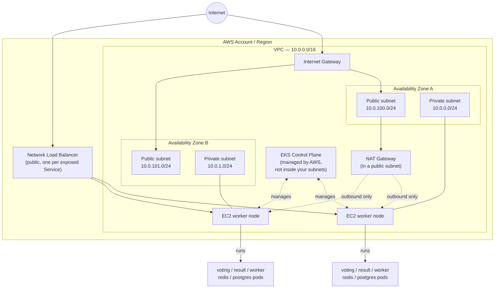

So now that you have a [basic understanding of how Terraform works](https://dev.to/kasir-barati/terraform-basics-32hf), before you start running any `terraform` command against a real AWS account, two things need to happen: you need an identity Terraform can authenticate as, and you need a mental picture of what you're about to create, so the plan output in Part 4 isn't just a list of unfamiliar resource names.

## Never Use Your AWS Root User!

The root user (the email/password you signed up to AWS with) can do _anything_, including closing the account. It should basically never be used day-to-day. Instead, create a dedicated **IAM user** just for this project. In real life you would create a dedicated IAM user for your CI/CD pipeline to automate deployments:

1. AWS Console → **IAM** → **Users** → **Create user** (e.g. `terraform-voting-app`).
2. Do **not** enable AWS Console access, this user only needs _programmatic_ access, i.e. an API key pair.
3. The AWS managed policy **`AdministratorAccess`** is the path of least friction, and is what you should use for the IAM user to test things out. but in real life you would go with least privilege approach, learn more about it in [AWS EKS IAM policy examples](https://docs.aws.amazon.com/eks/latest/userguide/security_iam_id-based-policy-examples.html).
4. On the user's **Security credentials** tab → **Create access key** → choose "Command Line Interface (CLI)". You'll get an **Access Key ID** and a **Secret Access Key**, store them somewhere safe, we will be needing them later.

## Give Terraform those Credentials

The rule: **credentials never go inside a `.tf` file, and never inside `terraform.tfvars`.** So in your local machine or CI/CD pipeline you need to export `AWS_ACCESS_KEY_ID`, `AWS_SECRET_ACCESS_KEY`, and `AWS_REGION` as environment variables in the shell. Then you won't be needing `aws configure` or `aws login` step anywhere, [the `aws` provider](https://github.com/kasir-barati/docker/blob/f95d3232e8233de98ba11bf8788537be5904a581/k8s/voting-microservice-architecture/deployment/terraform/providers.tf) has no `access_key`/`secret_key` arguments of its own, so it falls back to the AWS SDK's standard credential chain, which checks these exact environment variables first.

The AWS CLI and, later `kubectl` read the same variables. In my local machine I do [`export` an env variable files using a shell script](https://github.com/kasir-barati/docker/tree/f95d3232e8233de98ba11bf8788537be5904a581/k8s/voting-microservice-architecture/deployment/terraform#12-give-terraform-those-credentials). The export only lasts for the current shell session, re-run it in any new terminal before running `terraform`/`aws`/`kubectl`.

## What You are About to Build

This is the part most beginner Terraform/EKS tutorials skip, and it's the part that makes the actual `.tf` files make sense at a glance instead of feeling like a wall of unfamiliar arguments.

Reading it top to bottom:

- **VPC**: a private network inside AWS, `10.0.0.0/16` here (65k addresses is just the conventional default and more than what we need).
- **Two Availability Zones**: EKS requires subnets in at least 2 AZs, so a single AZ failure can't take the whole cluster down.
- **Public subnets** have a route to the Internet Gateway. Their only job is hosting the NAT Gateway and, later, the public-facing Load Balancers.
- **Private subnets** is where the actual EC2 worker nodes live. They have **no direct route in from the internet**, and no public IP at all.
- **NAT Gateway** lets the private-subnet nodes reach _out_ to the internet (to pull container images, talk to the EKS API, etc.) without allowing anything in from the internet. One-way door.
- **EKS Control Plane** is a managed AWS service which is the Kubernetes API server, scheduler, etc. It doesn't live "in" your subnets the way an EC2 instance does, though it does attach elastic network interfaces into them to talk to your nodes.
- **Worker nodes** are plain EC2 instances, sitting in the private subnets, that the EKS control plane schedules your pods onto. This is the "data plane", as opposed to the control plane above.
- **Network Load Balancer** is created later, _by Kubernetes_ (not Terraform) when you expose a Service as `type: LoadBalancer`. This is how traffic actually reaches your app from a browser.

### EKS Costs

We have two separate charges, both starting the moment `terraform apply` finishes:

1. The **EKS control plane** itself has a flat hourly rate. Check [current EKS pricing](https://aws.amazon.com/eks/pricing/) and this is regardless of whether any pods are running.
2. The **EC2 worker nodes**: ordinary EC2 billing, because they're ordinary EC2 instances. Two `t3.medium` nodes, in this project.

Plus a NAT Gateway (hourly + per-GB processed) and small EBS volumes for each node's disk. None of it is free-tier.

## Reference links

- [IAM: creating an IAM user](https://docs.aws.amazon.com/IAM/latest/UserGuide/id_users_create.html)
- [AWS EKS pricing](https://aws.amazon.com/eks/pricing/)
- [Amazon VPC concepts](https://docs.aws.amazon.com/vpc/latest/userguide/what-is-amazon-vpc.html)
- [How Amazon EKS works](https://docs.aws.amazon.com/eks/latest/userguide/what-is-eks.html)
