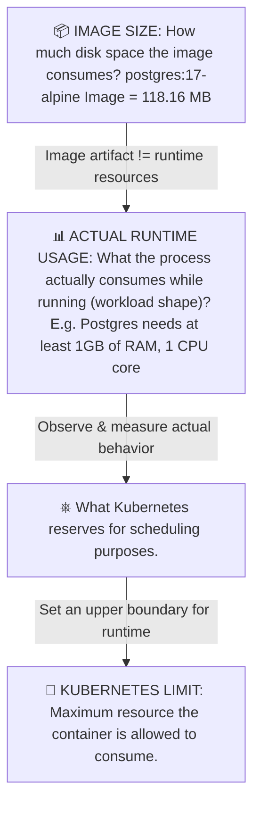

Maybe you also are curious as to why we picked `t3.medium` for the cluster and asked the obvious question: **is this cluster actually sized for what we're running on it, and how would we know if it stopped being sized for it?**

Is `t3.medium` ([the instance type `variables.tf` defaults to](https://github.com/kasir-barati/docker/blob/948d84f667d60107817b74f00bf50b16505af9fb/k8s/voting-microservice-architecture/deployment/terraform/variables.tf#L41)) actually enough for 11 pods across 2 nodes?

How would you get _paged_ the moment you're provisioned cluster runs out of resources instead of finding out from a `CrashLoopBackOff` at 2am?

> [!NOTE]
>
> JFYI, you might see `ContainerCreating` when running `kubectl get pods`, it basically means the kubelet has a node assigned and is doing setup work before the container process starts, and the single biggest contributor to that phase, on a brand new node, is **pulling the image**.

## Is `t3.medium` Actually Enough for These 11 Pods

Short answer: yes, comfortably so for the current setup 😉.

**What's actually running:** [`voting` (3 replicas)](https://github.com/kasir-barati/docker/blob/948d84f667d60107817b74f00bf50b16505af9fb/k8s/voting-microservice-architecture/deployment/voting-deployment.yaml), [`result-deployment` (3)](https://github.com/kasir-barati/docker/blob/948d84f667d60107817b74f00bf50b16505af9fb/k8s/voting-microservice-architecture/deployment/result-deployment.yaml), [`worker-deployment` (3)](https://github.com/kasir-barati/docker/blob/948d84f667d60107817b74f00bf50b16505af9fb/k8s/voting-microservice-architecture/deployment/worker-deployment.yaml), plus the standalone [`db`](https://github.com/kasir-barati/docker/blob/948d84f667d60107817b74f00bf50b16505af9fb/k8s/voting-microservice-architecture/deployment/db-pod.yaml) and [`redis`](https://github.com/kasir-barati/docker/blob/948d84f667d60107817b74f00bf50b16505af9fb/k8s/voting-microservice-architecture/deployment/redis-pod.yaml), 11 application pods in total, against [`node_desired_size = 2`, `node_min_size = 1`, `node_max_size = 3` Kubernetes worker nodes](https://github.com/kasir-barati/docker/blob/948d84f667d60107817b74f00bf50b16505af9fb/k8s/voting-microservice-architecture/deployment/terraform/variables.tf#L44-L60).

**It is important to understand that pods with the current setup are allocated per node, not CPU/RAM.** EKS caps pods per node by ENI/IP capacity, not raw compute, because of how the VPC CNI assigns a real VPC IP to every pod:

```text
max pods = (number of ENIs) × (IPv4 addresses per ENI − 1) + 2
```

For `t3.medium` that's 3 ENIs × (6 − 1) + 2 = **17 pods per node**.

Subtract system pods that live on every node (`kube-proxy`, `aws-node`/vpc-cni, and `coredns` typically spread across 1-2 nodes), let's say we have 3-5 slots already reserved. With that in mind we roughly have 12-14 app-pod slots per node, ~24-28 across the 2 desired nodes. 11 pods fits with room to spare. This ceiling might bite quietly by running out of slots the moment you scale replicas up (`kubectl scale --replicas=10 deployment/voting-deployment` would eat most of that headroom by itself, does not matter if it was auto-scaled or not).

**The other issue is that I did NOT declare `resources.requests`/`limits`.** Check [`voting-deployment.yaml`](https://github.com/kasir-barati/docker/blob/948d84f667d60107817b74f00bf50b16505af9fb/k8s/voting-microservice-architecture/deployment/voting-deployment.yaml), [`result-deployment.yaml`](https://github.com/kasir-barati/docker/blob/948d84f667d60107817b74f00bf50b16505af9fb/k8s/voting-microservice-architecture/deployment/result-deployment.yaml), [`worker-deployment.yaml`](https://github.com/kasir-barati/docker/blob/948d84f667d60107817b74f00bf50b16505af9fb/k8s/voting-microservice-architecture/deployment/worker-deployment.yaml), [`db-pod.yaml`](https://github.com/kasir-barati/docker/blob/948d84f667d60107817b74f00bf50b16505af9fb/k8s/voting-microservice-architecture/deployment/db-pod.yaml), and [`redis-pod.yaml`](https://github.com/kasir-barati/docker/blob/948d84f667d60107817b74f00bf50b16505af9fb/k8s/voting-microservice-architecture/deployment/redis-pod.yaml).

None of them tell Kubernetes its CPU or memory requirements! That means the scheduler treats every pod as needing **zero** resources for placement purposes, so it will keep packing pods onto a node with no real headroom check at all. That means we won't be seeing a clean `0/2 nodes are available: Insufficient memory` message when you're actually out of capacity.

Instead, actual memory usage creeps up under real traffic until the kubelet hits an eviction threshold and starts killing pods with `OOMKilled` or `Evicted`.

**`t3.medium` = 2 vCPU / 4 GiB RAM**. So we have the following:

| Component                        | Replicas | Role                  |
| -------------------------------- | -------: | --------------------- |
| PostgreSQL 17 Alpine             |        1 | Database              |
| Redis 7 Alpine                   |        1 | Queue                 |
| `example-voting-app-result`      |        3 | NodeJS result web app |
| `example-voting-app-vote`        |        3 | Python voting web app |
| `example-voting-app-worker`      |        3 | .NET worker           |
| **Total application containers** |   **11** |                       |

And you **do not get to treat those 4 GiB and 2 CPUs as application capacity**:

```text
┌───────────────────────────────┐
│ EC2 t3.medium                 │
│                               │
│ 2 vCPU                        │
│ 4 GiB RAM                     │
│                               │
│ ┌───────────────────────────┐ │
│ │ Linux / kernel            │ │
│ │ kubelet                   │ │
│ │ container runtime         │ │
│ │ AWS/EKS components        │ │
│ └───────────────────────────┘ │
│                               │
│ ┌───────────────────────────┐ │
│ │ Your Pods                 │ │
│ │                           │ │
│ │ postgres                  │ │
│ │ redis                     │ │
│ │ result ×3                 │ │
│ │ vote ×3                   │ │
│ │ worker ×3                 │ │
│ └───────────────────────────┘ │
└───────────────────────────────┘
```

[Kubernetes explicitly distinguishes **node capacity** from **node allocatable**](https://kubernetes.io/docs/tasks/administer-cluster/reserve-compute-resources). Allocatable is the amount available to Pods after accounting for resources reserved for Kubernetes/OS components. [AWS likewise documents reserving resources for kubelet/system daemons](https://docs.aws.amazon.com/eks/latest/eksctl/customizing-the-kubelet.html) because otherwise resource starvation can cause the node to become unhealthy.

**Another factor which I deliberately did not touch is the fact that `max_size = 3` doesn't mean autoscaling.** `node_max_size` only sets the ceiling on the _managed node group's_ underlying ASG. It's a permission slip, not a trigger. Nothing in our Terraform config actually watches for unschedulable pods and raises the desired count toward that ceiling. Without [Cluster Autoscaler](https://github.com/kubernetes/autoscaler) or [Karpenter](https://karpenter.sh/) installed in the cluster, you can be pod-starved with two idle nodes sitting at `desired_size = 2` and a third one it's _allowed_ to create but has no reason to 😅.

## Do NOT Calculate it Like this

> Postgres needs 512 MB, Redis needs 100 MB, each app needs 100 MB, therefore we're good.

That's not gonna work!

Also it worth mentioning that currently we need to wire up alerting to detect and respond to resource pressures. The signal we need is **unschedulable pods** (`Pending` with a `FailedScheduling` event citing insufficient CPU/memory/pod-IPs) and **node resource reservation** approaching 100%. AWS's own path for this is [CloudWatch Container Insights](https://docs.aws.amazon.com/AmazonCloudWatch/latest/monitoring/Container-Insights.html), which we can enable on the cluster. It publishes metrics like `node_cpu_reserved_capacity`, `node_memory_reserved_capacity`, and `cluster_failed_node_count` into CloudWatch, on top of which you set a plain CloudWatch Alarm:

```hcl
resource "aws_cloudwatch_metric_alarm" "node_memory_pressure" {
  alarm_name          = "${var.cluster_name}-node-memory-reserved-high"
  namespace           = "ContainerInsights"
  metric_name         = "node_memory_utilization"
  dimensions          = { ClusterName = var.cluster_name }
  statistic           = "Average"
  period              = 300
  evaluation_periods  = 2
  threshold           = 80
  comparison_operator = "GreaterThanThreshold"
  alarm_actions       = [aws_sns_topic.alerts.arn]
}
```

Container Insights will run an agent/Fluent Bit DaemonSet, there is a cheaper and more direct alternative: **alerting on `kube_pod_status_phase{phase="Pending"}`** via `kube-state-metrics` + [Prometheus + Alertmanager](https://prometheus.io/docs/alerting/latest/alertmanager) or we can go for the AWS-managed equivalent, Amazon Managed Service for Prometheus. That metric goes non-zero the instant a pod can't be placed.

We also must set `resources.requests`/`limits` in the manifests. Without them, Kubernetes has nothing to compare "current usage" against, so there's no signal to alarm on beyond raw node metrics. With requests set, you get two things for free: the scheduler stops overpacking nodes, and you can receive alarms on `kube_pod_container_resource_limits`, i.e. "this pod is at 90% of its memory limit" for example well before it gets `OOMKilled`. That's a config change to the `*-deployment.yaml` Kubernetes manifest files.

These are 4 different concepts to estimate how much CPU/RAM a pod will be needing:



Some good to know notes:

- **Workload shape, not habit.** E.g. this app is CPU-light, and memory-modest, but I/O intensive. A CPU-bound workload (video transcoding, heavy compute) wants compute-optimized (`c-family`); a memory-heavy workload (large caches, in-memory analytics) wants `r-family`.
- A production node group under steady load usually wants `m5`/`m6i` (fixed, non-burstable performance) instead, specifically to avoid throttling under sustained load (`t3.*` throttles under sustained load).
- If you're running many small pods (a common pattern with microservices), you can be pod-slot constrained well before you're resource-constrained. This is AWS-specific (the VPC CNI's IP-per-ENI model), not a general Kubernetes fact, and it's easy to miss because `kubectl describe node` reports it as `pods: 17`.
- ARM64 Graviton instances are typically 10-20% cheaper for equivalent performance on workloads that don't depend on x86-only binaries. So if you can swap `ami_type = "AL2023_x86_64_STANDARD"` for `AL2023_ARM_64_STANDARD` and the containers will be able to run then you can save on costs.
- Add something like this to your Kubernetes manifest files:

  ```yaml
  resources:
    requests:
      cpu: 500m
      memory: 512Mi
  ```

- Once traffic is real, you can collect metrics from [Kubelet `/metrics/resource` endpoint directly](https://kubernetes.io/docs/tasks/debug/debug-cluster/resource-metrics-pipeline/). Or [Container Insights](https://docs.aws.amazon.com/AmazonCloudWatch/latest/monitoring/ContainerInsights.html) tells you actual CPU/memory usage versus allocatable. Resize the node group only after you have that data.

  Imagine you measure a container's RAM usage 100 times (same is true for CPU):

  > 50, 51, 52, 53, ... 98, 100, 120 MiB

  Then you need to know:

  - **median**: roughly the point where 50% of measurements are below it and 50% are above it. So if median RAM = 70 MiB, the container typically uses around 70 MiB.
  - **p95**: 95% of your measurements are at or below this value. If it is 120 MiB, then 95% of your measurements are below 120 MiB. This is the answer to the **"How much does it use during almost all normal situations?"**
  - **p99**: is exactly the same as p95. And in layman's terms: **"How high does usage get during almost all situations, including occasional spikes?"**
  - **maximum**: The single highest measurement you observed. But be careful about this one, you might have measurements like this:

    ```text
    70
    72
    68
    75
    71
    69
    350  ← weird spike, investigate what happened at that time!
    ```

  - **behavior under load**: What happens to CPU, memory, latency, errors, etc. when you give the application more work? For example you could have:

    ```text
    Users/requests       CPU       RAM       Response time
    ──────────────────────────────────────────────────────
    10                    10%      80 MiB       20 ms
    100                   25%      90 MiB       25 ms
    500                   60%     120 MiB       40 ms
    1000                  95%     180 MiB      200 ms
    2000                 100%     300 MiB     2000 ms  ← struggling
    ```

  The simple mental model:

  ```text
  Median  → "What's typical?"
  P95     → "What happens most of the time, including busy periods?"
  P99     → "What happens during nearly all but the rarest spikes?"
  Maximum → "What's the biggest thing I actually observed?"
  Load    → "What happens when I give it more work?"
  ```

## So Why `t3.medium` & Takeaway

Honestly I just picked something that we can get over with in this tutorial, not a sized decision based on the workload 😅.

What's actually missing isn't node capacity, it's **visibility**: no `resources.requests`/`limits` on any pod, and no alerting layer watching either node pressure or pod-level usage. So before adopting similar setup for production traffic you must first add visibility.

> [!TIP]
>
> **Requests aren't actual usage.** This distinction causes enormous confusion in Kubernetes, so if you have:
>
> ```yaml
> resources:
>   requests:
>     memory: "1Gi"
>   limits:
>     memory: "2Gi"
> ```
>
> And **the application actually uses only 500MiB**, the node will still be overprovisioned. You can visualize it like this:
>
> ```text
> Node:
>     allocatable RAM = 2Gi
>
> Pods:
>     requests = 1Gi
>
> Actual usage:
>     500MiB
> ```
>
> This is why I said you **MUST add visibility to your infrastructure** first.
