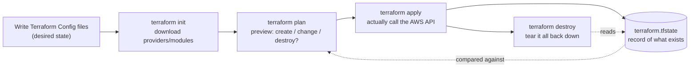

This is the first part of a real Terraform setup that provisions a brand new Amazon EKS cluster (VPC, control plane, worker nodes — everything, no pre-existing cluster assumed) and deploys a small multi-service voting app onto it. It assumes **no prior Terraform knowledge**, and I use Kubernetes manifests to deploy the app.

The actual Terraform code, and the plain Kubernetes manifests, live at [`k8s/voting-microservice-architecture/deployment`](https://github.com/kasir-barati/docker/tree/main/k8s/voting-microservice-architecture/deployment) in my `docker` repo. Feel free to give it a star 😉.

If you've ever created an AWS resource by clicking through the console, or run a pile of `aws ec2 ...`/`eksctl create cluster` commands from a half-remembered README you've felt the problem Terraform solves: **there is no reliable record of what you built, how to recreate it**.

Terraform's job is to fix that.

## What "Infrastructure as Code" Actually Means

You write down, in plain text files, **what should exist**: "a VPC with this CIDR," "an EKS cluster with 2 worker nodes", ...

You do not write the steps to create it. That distinction matters:

- **Imperative** (a shell script, `eksctl`, clicking in the console): you describe the _actions_, create this, then that, then attach this to that. If you run it twice, you either get an error ("already exists") or a duplicate 🥲.
- **Declarative** (Terraform, and Kubernetes too): you describe the _end state_. You run the same command as many times as you like; Terraform figures out the difference between "what exists" and "what you asked for", and only changes what's necessary.

If you've ever written a Kubernetes YAML manifest and run `kubectl apply -f .` more than once, you already understand declarative infrastructure. Terraform applies the identical idea one layer down, to the cloud resources underneath the cluster (or, as in this project, _including_ the cluster itself).

## The Building Blocks (HCL)

Terraform's config language is called HCL (HashiCorp Configuration Language). You'll see four kinds of blocks constantly:

```hcl
# 1. A provider - which cloud/API Terraform should talk to
provider "aws" {
  region = "us-east-1"
}

# 2. A resource - one real thing to create
resource "aws_s3_bucket" "example" {
  bucket = "my-unique-bucket-name"
}

# 3. A variable - an input you can change without editing the file
variable "region" {
  type    = string
  default = "ap-east-1"
}

# 4. An output - a value Terraform prints after it's done
output "bucket_name" {
  value = aws_s3_bucket.example.bucket
}
```

That's genuinely most of the language. Everything else, loops (`for_each`/`count`), conditionals, functions like `cidrsubnet()` are sugar on top of "declare resources, wire them together with references".

One more block type you'll see a lot in this project is **`module`**. A module is just a folder of `.tf` files someone else already wrote and published, that you can reuse instead of writing hundreds of lines of `resource` blocks yourself:

```hcl
module "vpc" {
  source  = "terraform-aws-modules/vpc/aws"   # published on the Terraform Registry
  version = "~> 6.0"
  cidr    = "10.0.0.0/16"
}
```

Under the hood a module is exactly the same `resource`/`variable`/`output` blocks you just saw, someone packaged them up so you don't have to setup "a correct VPC" from scratch each time. More on [the Terraform Registry](https://registry.terraform.io/).

## The Workflow: 4 Commands



- **`terraform init`** downloads the providers and modules your config references. We run it once per directory, and again whenever we add/change a provider/module version.
- **`terraform plan`** asks the AWS API "what exists right now that you're tracking?", diffs that against your `.tf` files, and prints what would change. **Nothing is created or changed by `plan`.** Always read the plan before applying, it's the single best safety net Terraform gives you.
- **`terraform apply`** shows what it will change, asks you to type `yes`, then actually calls the API of AWS or any other provider. Terraform works out the correct order on its own (e.g. it won't try to create a subnet before the VPC that subnet belongs to) by following the references between your resources.
- **`terraform destroy`** deletes everything Terraform currently has in its state, in dependency order.

## State: The One File You Need to Ensure is Never Lost

Every time you `apply`, Terraform writes a file which by default is called `terraform.tfstate`. It records exactly what it created. E.g. when provisioning AWS services it keeps a track of the real AWS IDs of each resource (this VPC's actual `vpc-0abc123...`, that cluster's actual ARN, ...).

This file is _the_ thing that makes Terraform work. Without it, Terraform has no way to know "I already made this VPC, don't make another one" or "if you ask me to destroy, here's exactly what to delete". A few rules that follow directly from that:

- **Never hand-edit it.** Use `terraform state` subcommands if you truly need to intervene.
- **Never commit it to a public repo.** It can contain sensitive values (e.g. database passwords set via a resource argument) in plain text.
- **Don't run `apply` from two places at once against the same state file.** Two concurrent applies can corrupt it. (Real teams solve this with a _remote backend_, e.g. state is stored in a S3 bucket, or in Terraform Cloud. [Learn more about Terraform backends](https://developer.hashicorp.com/terraform/language/backend).
- **If you delete it, Terraform "forgets" everything it made!** It won't know how to clean those resources when you run `terraform destroy` anymore, and it'll try to create duplicates on the next `terraform apply`.

## Where to go Deeper

- [Terraform's own "What is Terraform?" docs](https://developer.hashicorp.com/terraform/intro)
- [HCL syntax reference](https://developer.hashicorp.com/terraform/language/syntax/configuration)
- [Terraform Registry](https://registry.terraform.io/) — where providers and modules are published
- [Terraform state docs](https://developer.hashicorp.com/terraform/language/state)
