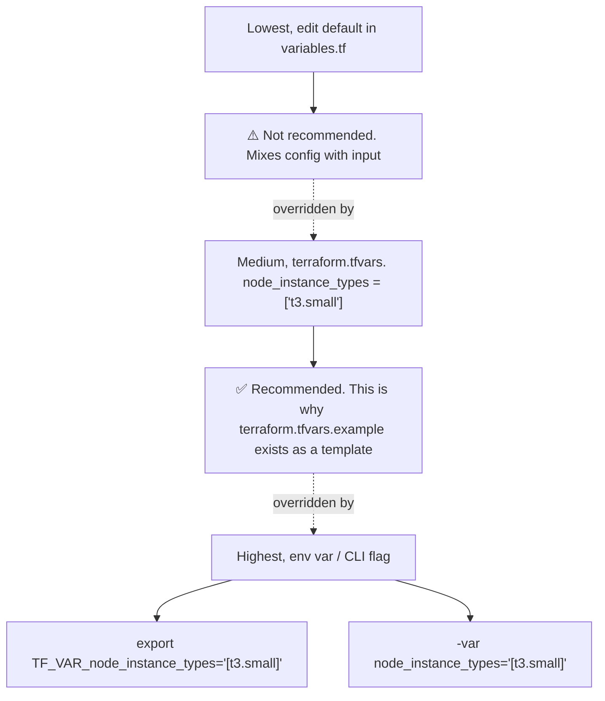
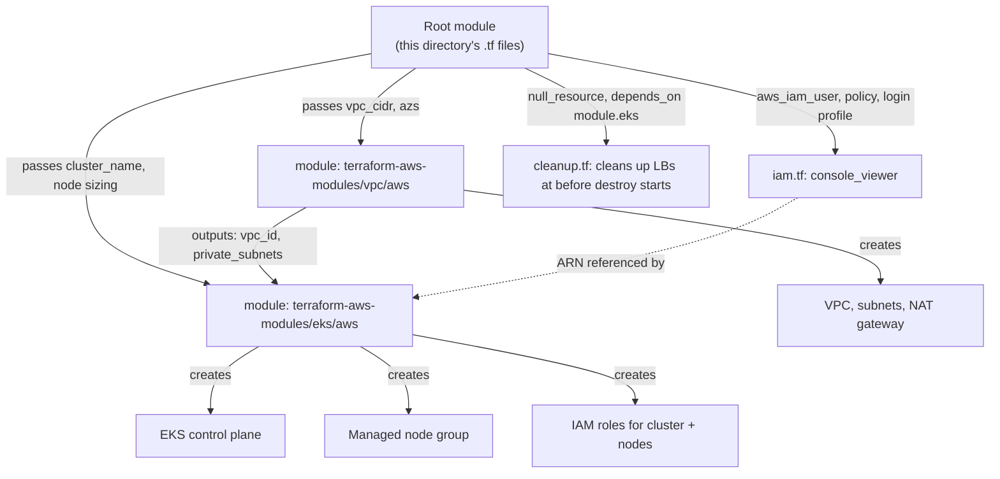

In this post I will walk through [Terraform config files](https://github.com/kasir-barati/docker/tree/948d84f667d60107817b74f00bf50b16505af9fb/k8s/voting-microservice-architecture/deployment/terraform). Here's the map before we zoom in file by file:

| File                       | Purpose                                                                                                         |
| -------------------------- | --------------------------------------------------------------------------------------------------------------- |
| `versions.tf`              | Pins Terraform and provider versions                                                                            |
| `providers.tf`             | Configures _which_ AWS account/region Terraform talks to                                                        |
| `variables.tf`             | Every configurable input, with sane defaults                                                                    |
| `vpc.tf`                   | The network: VPC, subnets, NAT gateway                                                                          |
| `eks.tf`                   | The cluster: control plane, IAM roles, worker nodes, and the read-only access entry for the Console-viewer user |
| `iam.tf`                   | The human, Console-only IAM user used to browse pods/logs in the AWS Console                                    |
| `data.tf`                  | Read-only data sources (currently just the account ID)                                                          |
| `outputs.tf`               | Values printed after `apply`                                                                                    |
| `cleanup.tf`               | A destroy-time hook that removes Kubernetes-created LoadBalancers before the cluster/VPC teardown               |
| `terraform.tfvars.example` | Template for overriding defaults                                                                                |

Terraform doesn't care about file names or how many files you split things across. It reads _every_ `.tf` file in the directory and merges them into one configuration. The split above is purely for us to have an easier time comprehending what we have.

## [`versions.tf`](https://github.com/kasir-barati/docker/tree/948d84f667d60107817b74f00bf50b16505af9fb/k8s/voting-microservice-architecture/deployment/terraform/versions.tf)

In this file we have `required_version` which stops anyone from running this with a Terraform version old enough to not understand some syntax used here. `required_providers` does the same for the AWS provider.

> [!TIP]
>
> `~> 6.0` means "any `6.x`, but not `7.0`," so you get bugfixes automatically without silently picking up a breaking major version. This is what makes `terraform init` reproducible on a different laptop or in CI a year from now.
>
> ```mermaid
> flowchart LR
>     A["~> 1.5.0"] --> B["1.5.0 - Allowed"]
>     A --> C["1.5.7 - Allowed"]
>     A --> D["1.6.0 - NOT Allowed"]
>
>     E["~> 1.5"] --> F["1.5.0 - Allowed"]
>     E --> G["1.9.0 - Allowed"]
>     E --> H["2.0.0 - NOT Allowed"]
> ```

## [`providers.tf`](https://github.com/kasir-barati/docker/tree/948d84f667d60107817b74f00bf50b16505af9fb/k8s/voting-microservice-architecture/deployment/terraform/providers.tf)

Sets `region`, read from a variable rather than being hardcoded, so switching regions is a one-line change in `terraform.tfvars`, not a find-and-replace across every file.

> [!TIP]
>
> `default_tags` is applied to _every single resource_ the AWS provider creates in this run. It's how every VPC, EC2 instance, IAM role, etc. ends up tagged `Project = voting-microservice-architecture` without repeating that tag block 20 times. Handy for finding everything this project owns in the AWS console later, and it's extremely useful when a module creates a resource which you did not specify in your own Terraform config files.

## [`variables.tf`](https://github.com/kasir-barati/docker/tree/948d84f667d60107817b74f00bf50b16505af9fb/k8s/voting-microservice-architecture/deployment/terraform/variables.tf)

Every variable follows this shape: a `type` (string, number, bool, `list(string)`, ...), a human-readable `description`, and usually a `default` so the project works out of the box. BTW this is variable precedence for overriding defaults:



This project defines: `aws_region`, `environment`, `cluster_name`, `kubernetes_version`, `vpc_cidr`, `azs`, node sizing (`node_instance_types`/`node_desired_size`/`node_min_size`/`node_max_size`), `cluster_endpoint_public_access`, and `console_viewer_username`. Full list with descriptions can be seen in [the `variables.tf`](https://github.com/kasir-barati/docker/blob/948d84f667d60107817b74f00bf50b16505af9fb/k8s/voting-microservice-architecture/deployment/terraform/variables.tf).

## [`vpc.tf`](https://github.com/kasir-barati/docker/blob/948d84f667d60107817b74f00bf50b16505af9fb/k8s/voting-microservice-architecture/deployment/terraform/vpc.tf)

A few things worth explaining if you haven't used Terraform's function syntax before:

- **`module "vpc" { source = "...", version = "..." }`** is what we meant by "reuse someone's published `.tf` files" in action. `source` points at [`terraform-aws-modules/vpc` on the Terraform Registry](https://registry.terraform.io/modules/terraform-aws-modules/vpc/aws/latest); instead of us hand-writing every `aws_subnet`, `aws_route_table`, `aws_nat_gateway`, etc. (which is a lot of boilerplate to get exactly right), we're using a battle-tested module that thousands of other projects already rely on.
- **Why CIDR exists:** every resource in your VPC (nodes, load balancers, NAT gateway) needs its own private IP address, and something has to decide up front which addresses are "ours" to hand out. Before your VPC can exist, you have to reserve a block of addresses for it, like requesting a range of extension numbers for an office phone system before anyone can be assigned one. CIDR notation (`10.0.0.0/16`) is just the shorthand for "reserve this block".
- **`cidrsubnet`** is a built-in Terraform function that carves a smaller CIDR block out of a bigger one.
- We have a loop in there too so 2 AZs in the variable become 2 actual private subnets and 2 public subnets (offset by `+ 100` so public and private CIDRs never collide).
- **The `*_subnet_tags` blocks** is the part that AWS integration of Kubernetes uses to discover _which subnets to use_ by looking for these exact tag keys:
  - `kubernetes.io/role/elb` on public subnets tells the cluster "put internet-facing Load Balancers here".
  - `kubernetes.io/role/internal-elb` does the same for internal ones.
  - `kubernetes.io/cluster/<name> = shared` marks a subnet as belonging to this cluster.

  Skip these tags and `type: LoadBalancer` Kubernetes services simply won't provision correctly. Documented here: [EKS VPC and subnet requirements](https://docs.aws.amazon.com/eks/latest/userguide/network-reqs.html).

## [`eks.tf`](https://github.com/kasir-barati/docker/blob/948d84f667d60107817b74f00bf50b16505af9fb/k8s/voting-microservice-architecture/deployment/terraform/eks.tf)

- **`vpc_id = module.vpc.vpc_id`** and **`subnet_ids = module.vpc.private_subnets`** is how Terraform wires two modules together, and it's _also_ how Terraform knows the VPC must be created before the cluster. `module.vpc.vpc_id` is an **output** of the `vpc` module (every module can expose outputs the same way the root configuration does, from `outputs.tf`). You never had to write "create the VPC first"; Terraform derived that from the fact that `eks.tf` reads a value that only exists once `vpc.tf` has run.
- **Worker nodes go in `module.vpc.private_subnets`**.
- **`enable_cluster_creator_admin_permissions = true`** is what enables the IAM user who ran `terraform apply` to issue `kubectl` commands against. This flag registers your IAM identity as a cluster admin automatically via an [EKS access entry](https://docs.aws.amazon.com/eks/latest/userguide/access-entries.html), which is the modern replacement for the old, fiddlier `aws-auth` ConfigMap approach.
- **`access_entries.console_viewer`** is the entry for IAM user I intend it to be allowed to look at the cluster. `enable_cluster_creator_admin_permissions` only ever creates one access entry, for the apply-time identity; a second human who wants to browse pods/logs in the AWS Console needs their own. This block grants exactly that: it maps `aws_iam_user.console_viewer`'s ARN (`iam.tf`) to AWS's managed `AmazonEKSViewPolicy` (read-only, cluster-scoped) via a Kubernetes-RBAC access entry.
- **`addons`** are AWS-managed installs of standard Kubernetes cluster components, so you don't `kubectl apply` them yourself: `coredns` (in-cluster DNS is how `redis` and `db` hostnames in the app's connection strings actually resolve), `kube-proxy` (routes service traffic to the right pod), `vpc-cni` (gives every pod a real VPC IP address, the AWS-specific way pod networking works on EKS), and `eks-pod-identity-agent` (lets pods assume IAM roles, a near-mandatory addon for anything that'll later talk to S3/DynamoDB/etc. from inside a pod). `before_compute = true` on two of them means "install this before the worker nodes even join" since nodes need working pod networking to function.
- **`eks_managed_node_groups`** is the actual EC2 Auto Scaling group your pods run on. `AL2023_x86_64_STANDARD` is Amazon Linux 2023, the current default EKS-optimized AMI type. `min_size`/`max_size`/`desired_size` are Auto Scaling group settings, Kubernetes' own autoscaler (if you added one) would adjust `desired_size` between the min/max bounds; here they're fixed at whatever `terraform.tfvars` says.

> [!TIP]
>
> The Amazon Linux 2023, x86_64 architecture, "standard" (no GPU, no ARM), this is the image we used. Other options include things like `AL2023_ARM_64_STANDARD` (Graviton/ARM), or `_NVIDIA`/`_GPU` variants for GPU workloads.

Full module docs, including every other option available: [terraform-aws-modules/eks/aws on the Registry](https://registry.terraform.io/modules/terraform-aws-modules/eks/aws/latest).

## [`iam.tf`](https://github.com/kasir-barati/docker/blob/948d84f667d60107817b74f00bf50b16505af9fb/k8s/voting-microservice-architecture/deployment/terraform/iam.tf)

`enable_cluster_creator_admin_permissions` covers the automation identity that runs `terraform apply`. It deliberately has no AWS Console access. So if you personally want to open the EKS Console and click through pods, clusters, etc, that's a **second, separate** IAM identity, created in `iam.tf`.

- **`aws_iam_user.console_viewer`**: the IAM user itself, named by default `voting-app-console-viewer`.
- **`aws_iam_user_policy`**: grants only enough to _reach_ the EKS API: the account-level `ListClusters`/`DescribeClusterVersions`, and `DescribeCluster`/`AccessKubernetesApi` scoped to this cluster only (`module.eks.cluster_arn`). This policy grants permission to AWS Console access; the RBAC half is [the `access_entries` block in `eks.tf`](https://github.com/kasir-barati/docker/blob/948d84f667d60107817b74f00bf50b16505af9fb/k8s/voting-microservice-architecture/deployment/terraform/eks.tf#L19-L30). We need both, and they answer different questions ("can this principal call the EKS API at all" vs. "what can it do once inside the cluster").
- **`aws_iam_user_login_profile`**, with `password_reset_required = true` generates a one-time password and forces a change on first login. In my experience they usually do not do this, instead DevOps team grant permission to each developer appropriate access rights and it is tied to their role in the organization.
- **`aws_iam_user_policy_attachment`** adds AWS's managed `IAMUserChangePassword` policy to enable users get self-service `iam:ChangePassword` permission to change their own password.

## [`data.tf`](https://github.com/kasir-barati/docker/blob/948d84f667d60107817b74f00bf50b16505af9fb/k8s/voting-microservice-architecture/deployment/terraform/data.tf)

- A `data` block, unlike `resource`, doesn't create anything.
- It just reads information that already exists, here the AWS account ID of whoever's credentials are active.
- We need it when building the AWS Console sign-in URL in `outputs.tf` (`https://<account_id>.signin.aws.amazon.com/console`), which requires knowing the account ID.

## [`cleanup.tf`](https://github.com/kasir-barati/docker/blob/948d84f667d60107817b74f00bf50b16505af9fb/k8s/voting-microservice-architecture/deployment/terraform/cleanup.tf)

Before we can torn down this cluster's VPC/subnets, we must first use `kubectl` and delete `voting-service.yaml`/`result-service.yaml`. This frees the AWS Load Balancers Kubernetes created for them. Those Load Balancers were never created by a `resource` block, so Terraform's state doesn't know they exist and `terraform destroy` alone can't remove them. Or at least this is what my lizard brain thinks considering [all the hints I saw here](https://serverfault.com/questions/1103575/terraform-destroy-failing-for-kubernetes-provider-with-pvc-in-aws-eks-how-to-fi) and [there](https://stackoverflow.com/questions/76417271/terraform-destroy-on-eks-fails-within-github-actions-workflow). But still since [I was not so sure I asked it here](https://repost.aws/questions/QU-1eaoDeuThmDyQnj8qCGPQ/do-kubernetes-loadbalancer-services-need-to-be-deleted-before-terraform-destroy-when-eks-is-provisioned-by-terraform-but-nlbs-are-not).

## [`outputs.tf`](https://github.com/kasir-barati/docker/blob/948d84f667d60107817b74f00bf50b16505af9fb/k8s/voting-microservice-architecture/deployment/terraform/outputs.tf)

Outputs are Terraform's way of handing you (or another Terraform config, or a CI pipeline) values it only knows after resources actually exist. Here we print stuff like AWS Console login URL, username, cluster endpoint, etc.

> [!TIP]
>
> When we dump something in the output you can mark it as sensitive so it won't show in the CI/CD pipeline logs in plain text. That is what I did for the temporary password. So if you need to see the value in plain text you must run `terraform output -raw console_viewer_initial_password` to actually read it.

## How the pieces fit together


